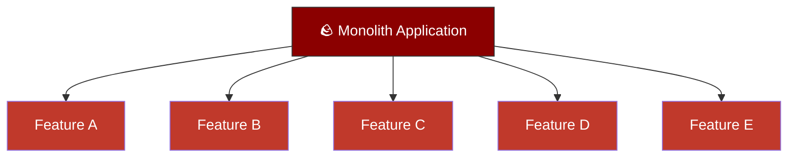
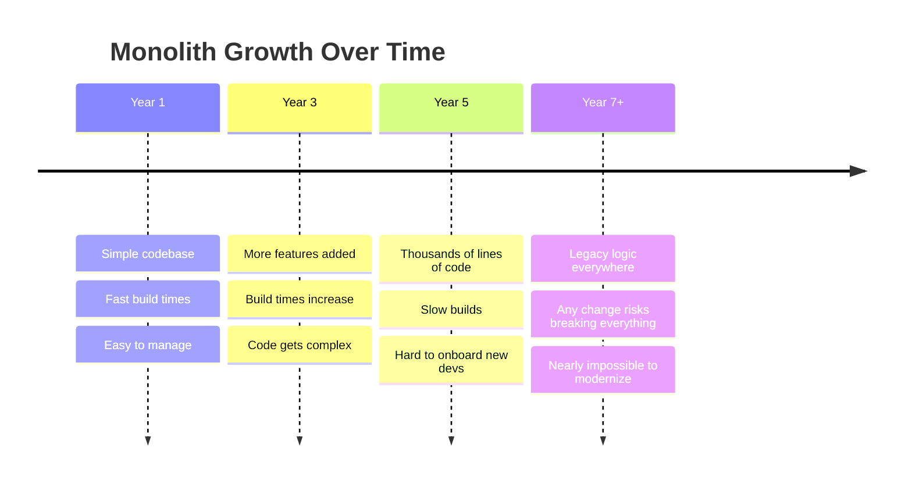
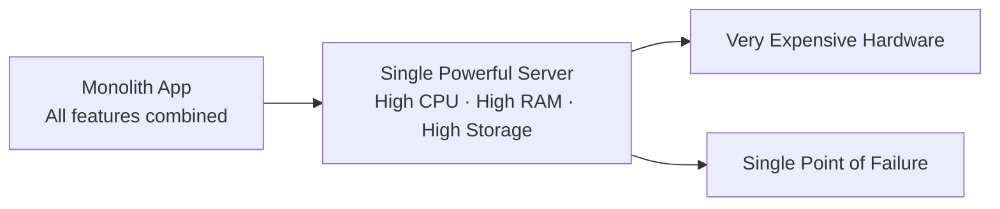
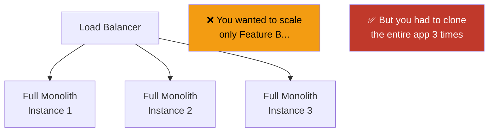
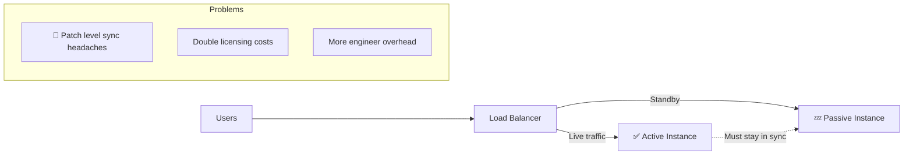

# The Legacy Monolith

## What is a Monolith?

Think of a monolith application like a **massive, old government building** — everything happens under one roof. The _HR department_, the _post office_, the _courts_, and the _DMV_ are all crammed into the same building, sharing the same plumbing, electricity, and hallways. If the plumbing **breaks**, **everyone is affected**. If you need more space for the DMV, you can't just expand that one room — you have to build an entirely new copy of the whole building.
That's essentially what a monolith is: **one giant application where all the features live together as a single unit**, built on old architecture, and written in a single (often outdated) programming language.

## Why is it Hard to Move to the Cloud?

Not every application is ready for the cloud. The course uses a great analogy — moving an app to the cloud should feel like picking up pebbles on a beach: light, easy, flexible. But a monolith is more like a **1,000-ton boulder** — you can't easily pick it up and carry it anywhere.

Over years of development, monoliths accumulate:

- Thousands of lines of tightly coupled code
- Layer upon layer of features and patches
- Outdated design patterns that were never meant for modern infrastructure

The longer it lives, the heavier it gets.

_Everything is one unit. You can't separate or move individual features — they're all baked in together_.

## The Development Pain

As the codebase grows, so does the developer's frustration. Every time someone adds a new feature or fixes a bug:

- The entire application has to be **reloaded**, **recompiled**, and **rebuilt** — even if only one small part changed.
- Build times get longer with every update.
- Developers spend more time waiting than coding.

The only silver lining? Since it runs on a **single server**, administration is relatively simple — there's only one place to look when something goes wrong.

## The Hardware Problem

Because the monolith is one giant process, it needs one very powerful machine to run on — a machine that can handle all its **computing**, **memory**, **storage**, and **networking** demands simultaneously.

Think of it like powering an entire city from **a single, massive generator**. That generator has to be:

- Extremely powerful (and expensive)
- Specially sourced and procured
- Maintained around the clock

If that generator fails, the whole city goes dark.

## Scaling is a Nightmare

What happens when only one feature of your app gets a surge in traffic — say, your login service gets hammered during peak hours? With a monolith, **you can't scale just that one feature**. You have to scale the entire application.

It's like your restaurant gets too busy at the bar, but instead of hiring more bartenders, you have to **clone the entire restaurant** — kitchen, waitstaff, and all — and put it next door.

_Each new instance needs its own full hardware setup — meaning scaling costs multiply rapidly_.

## Downtime is Inevitable

Whenever the monolith needs an update, a patch, or a migration, **the whole application has to go down**. There's no way to update just one part while the rest keeps running. Maintenance windows have to be planned well in advance, and customers will feel the disruption.

Some teams try to reduce this pain by running the monolith in an **active/passive** configuration — two identical copies where one is live and the other is on standby. But this introduces new problems:

| Approach          | Benefit          | Drawback                                                                             |
| ----------------- | ---------------- | ------------------------------------------------------------------------------------ |
| Single instance   | Simple to manage | Any update = full downtime                                                           |
| Active/Passive HA | Reduced downtime | Both systems must stay in sync, extra licensing costs, more complexity for engineers |

**The key takeaway**: Monoliths aren't inherently bad — they made sense when they were built. But as applications grow and user demands increase, their limitations become a serious bottleneck. This is exactly the problem that **microservices and Kubernetes** were designed to solve.
