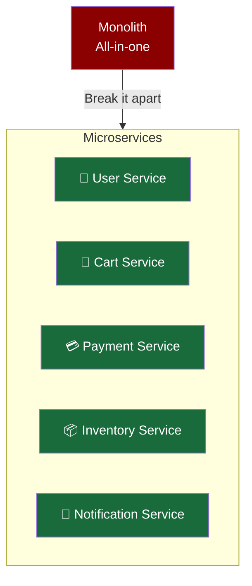
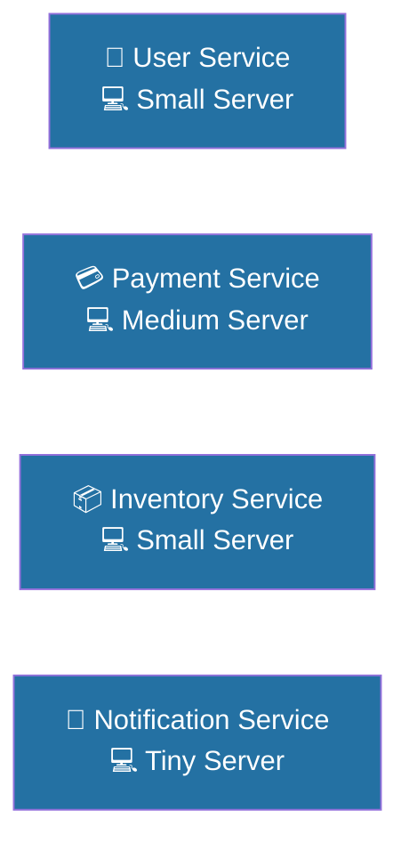
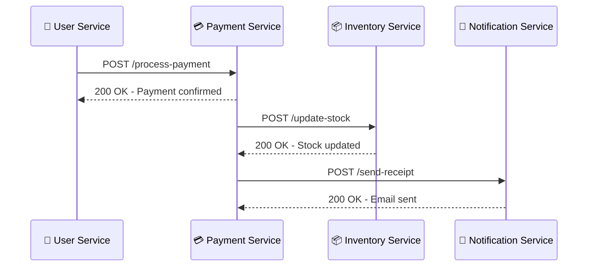
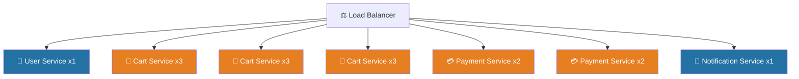
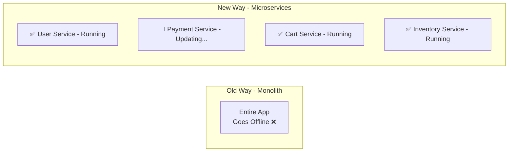
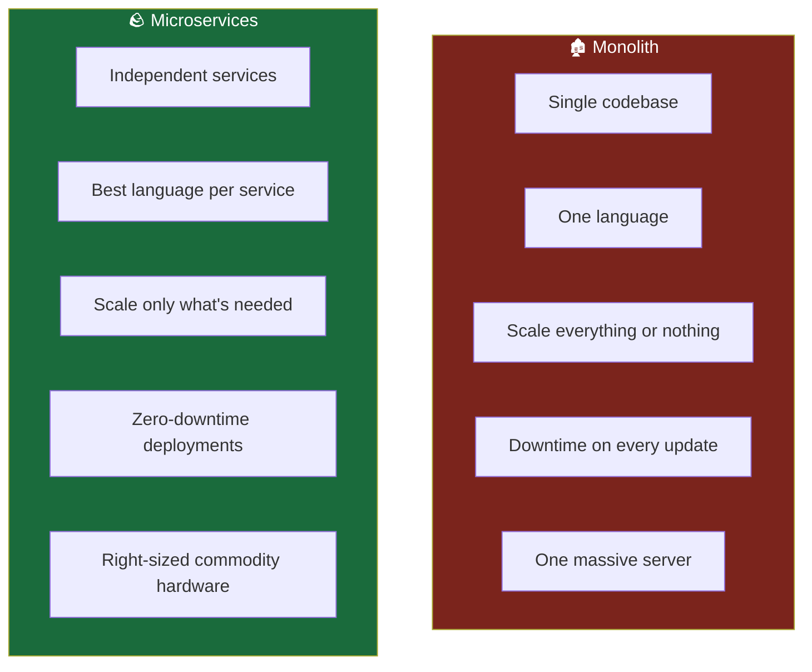

# 🪨 The Modern Microservice

## From Boulder to Pebbles

Remember the 1,000-ton boulder from the last section? Now imagine breaking it apart into individual pebbles. Each pebble is small, lightweight, and easy to carry. You can sort them by **colour**, **size**, or **shape**. You can move just one without disturbing the others. And when you weigh all the pebbles together, they still add up to the same boulder — just infinitely more manageable.

**That's exactly what microservices do to a monolith**. The giant, tangled application gets carved up into small, independent services — each one responsible for a single business function. Together they form the full application. Separately, they're free to **move**, **scale**, and **evolve** on their own.

## Each Service Runs on Its Own

Because each microservice is independent, it can be deployed on its own server — and that server only needs to be powerful enough to run that **one service**. No more provisioning a massive, expensive machine just to host one giant app.

Think of it like renting desk space. Instead of leasing an entire office building for one employee, you rent just the desk they need. Multiply that across many services and the cost savings become significant.

_Each service gets only the resources it actually needs — nothing more, nothing less_.

## How Do They Talk to Each Other?

Since the services are now separated, they need a way to communicate. They do this through **APIs (Application Programming Interfaces)** — essentially, agreed-upon channels through which services send and receive information over a network.

This model is aligned with two well-known architectural patterns:

- **Event-Driven Architecture (EDA)** — services react to events (e.g., "payment confirmed" triggers the inventory service to update stock).
- **Service-Oriented Architecture (SOA)** — the app is composed of many small, focused services that collaborate.

Think of APIs like a **restaurant ordering system**. The waiter (API) takes your order (request) from your table (one service) and delivers it to the kitchen (another service) — neither side needs to know how the other works internally.

_Services don't need to know each other's internals — they just agree on the API contract and communicate through it_.

## The Right Tool for the Right Job

In a monolith, the entire application is written in one language — even if parts of it would be better suited to something else. With microservices, **each team picks the best language for their specific service**.

| Service              | Best Language Choice | Why                                            |
| -------------------- | -------------------- | ---------------------------------------------- |
| Payment Service      | Java / C#            | Strong typing, reliability, enterprise support |
| Notification Service | Python               | Fast scripting, great library support          |
| Real-time Chat       | Node.js              | Non-blocking, handles many connections         |
| Data Processing      | Python / Go          | High performance, great data libraries         |
| Frontend API Gateway | Go / Node.js         | Lightweight, fast I/O                          |

_This flexibility also means services can be deployed on cheap commodity hardware, rather than specialised expensive machines — because each service is lean and purpose-built._

## Scaling Only What You Need

This is one of the biggest wins of microservices. Instead of cloning the entire application when traffic spikes, you scale **only the service under pressure**.

Imagine it's Black Friday. Your payment and cart services are getting hammered, but your notification service is barely being used. With microservices, you scale just those two — saving money and resources.

_Scaling can be done manually or automatically through **autoscaling** — where the system detects demand and spins up new instances on its own_.

## Zero-Downtime Deployments

Upgrading a monolith means taking the whole application offline. With microservices, you update **one service at a time** while everything else keeps running. Users experience no interruption.

_This means teams can release new features and fixes **continuously and independently** — different teams own different services and can ship without waiting on anyone else_.

## Monolith vs Microservices — Side by Side

| Feature         | Monolith              | Microservices            |
| --------------- | --------------------- | ------------------------ |
| Deployment      | Whole app at once     | One service at a time    |
| Scaling         | All or nothing        | Granular, per service    |
| Downtime        | Inevitable on updates | Near zero                |
| Hardware        | One powerful machine  | Many small servers       |
| Language        | Single language       | Best fit per service     |
| Team structure  | One big team          | Small, independent teams |
| Speed to market | Slow                  | Fast and agile           |

_**Key Takeaway**: Microservices don't eliminate complexity — they redistribute it in a way that's far easier to manage, scale, and evolve. The trade-off is that you now have many moving parts to coordinate, which is exactly why tools like Kubernetes exist_.
