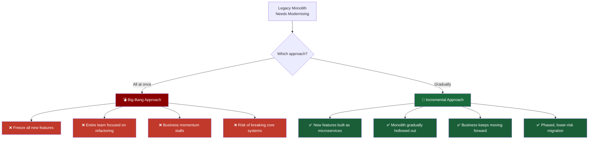
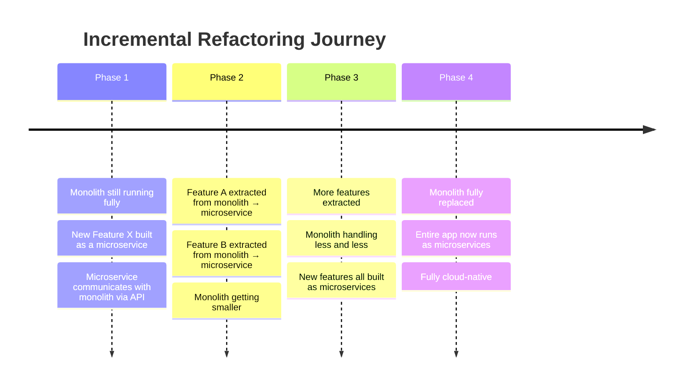
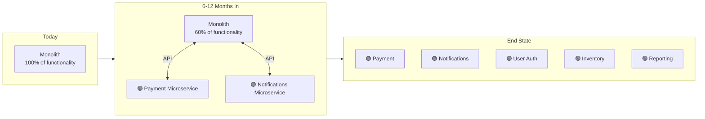
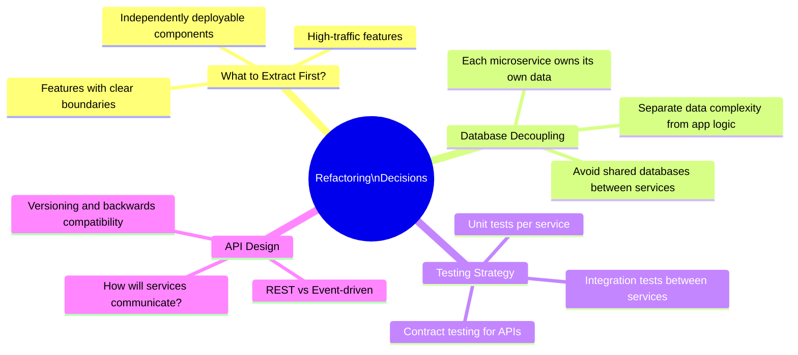
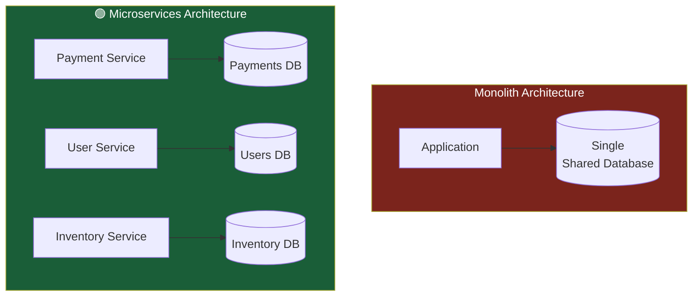
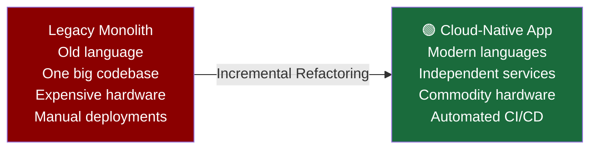

# 🔧 Refactoring — Giving the Monolith a Second Life

## The Reality for Established Enterprises

Modern startups have the luxury of building cloud-native from day one — they start with microservices, APIs, and containers baked in. But what about a bank, retailer, or insurer that has been running the same monolith for 20+ years?

They can't just delete it and start fresh. That monolith is the business. It processes payments, manages accounts, runs operations. Shutting it down to rebuild it is like performing open-heart surgery while the patient is running a marathon.

Some enterprises tried the shortcut — taking their monolith and simply running it as if it were microservices. It didn't work. A monolith is fundamentally designed to run as one big process. Splitting it superficially doesn't change its internal wiring. The lesson learned: **you can't fake microservices — you have to earn them through refactoring**.

## The Refactoring Dilemma: Big-Bang vs Incremental

Once an enterprise commits to refactoring, the first major decision is _how_. There are two approaches, and choosing the wrong one can be catastrophic.

## The Big-Bang Approach — Risky and Costly

Imagine a construction company that decides to demolish an entire skyscraper and rebuild it from scratch — but tells all the tenants they have to wait outside until it's done. No business runs that way.

The Big-Bang approach works the same way:

- **All development stops**. No new features, no improvements — just refactoring.
- The business stagnates while competitors keep shipping.
- The entire codebase is being rewritten at once, meaning if something goes wrong midway, **you may have broken the monolith without having microservices ready to replace it yet**.

It's a high-stakes, all-or-nothing gamble.

## The Incremental Approach — The Safer Path

The incremental approach is far more practical. Think of it like **renovating a house while still living in it** — one room at a time. You're never left without shelter, and the house gradually becomes exactly what you want.

Here's how it plays out in practice:

The key insight is that new features **never get added to the monolith**. They are built as microservices from day one and communicate back to the monolith through APIs. Meanwhile, old features are gradually extracted out — until the monolith quietly fades away.

## The Key Decisions During Refactoring

Choosing incremental refactoring is just the beginning. The team then faces a series of important technical decisions:

### Breaking Apart the Database

One of the trickiest parts of refactoring is **the database**. In a monolith, everything shares one giant database. When you extract a microservice, it needs its own dedicated data store — otherwise you haven't truly separated it.

_Each service owns its data. No service reaches directly into another service's database — it must go through the API_.

## The End Result: A Cloud-Native Application

After all the refactoring work, what you're left with is something that looks nothing like where you started. The application is now:

- Written in **modern programming languages**, best suited to each service
- Built on **modern architectural patterns** (event-driven, API-first, containerised)
- Able to fully leverage **cloud features** — autoscaling, managed databases, serverless, CI/CD pipelines

The monolith didn't die — it **evolved**. Like a caterpillar that slowly restructures itself inside a cocoon and emerges as something completely different, refactoring is the enterprise's transformation journey.

### Summary

|                               | Big-Bang       | Incremental                      |
| ----------------------------- | -------------- | -------------------------------- |
| New features during migration | ❌ Frozen      | ✅ Continuously delivered        |
| Risk level                    | 🔴 Very High   | 🟡 Manageable                    |
| Business disruption           | 🔴 Significant | 🟢 Minimal                       |
| Time to first results         | Very long      | Short — visible progress quickly |
| Recommended?                  | Rarely         | Almost always                    |

**Key Takeaway**: Refactoring is not a rewrite — it's a **controlled, gradual transformation**. The incremental approach lets the business keep moving while the architecture modernises underneath it. By the end, the monolith has been given a second life — reborn as a modular, cloud-native system ready for the modern world. This is the foundation on which Kubernetes becomes truly powerful.
