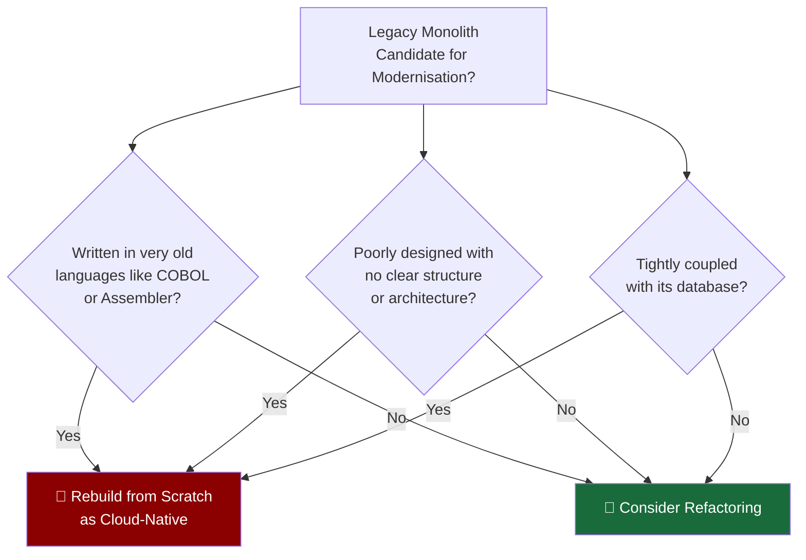
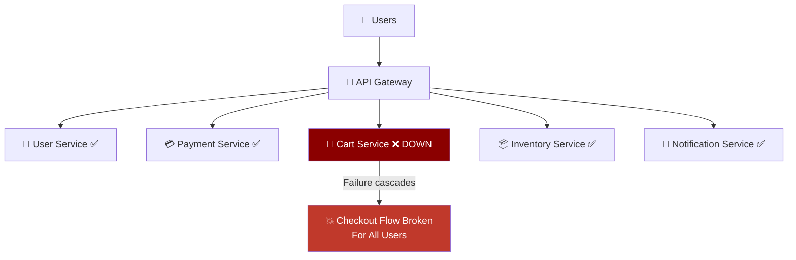
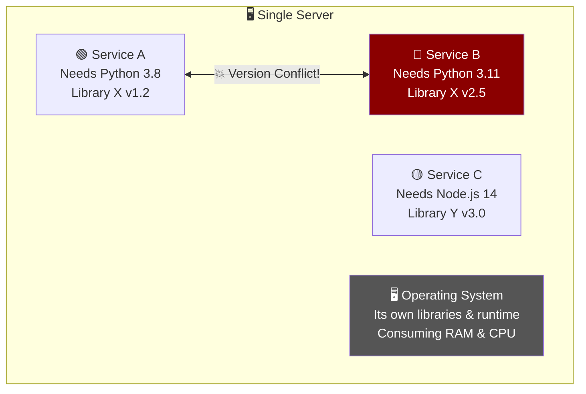
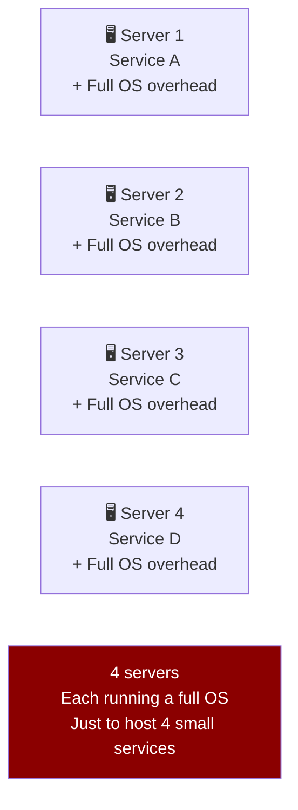
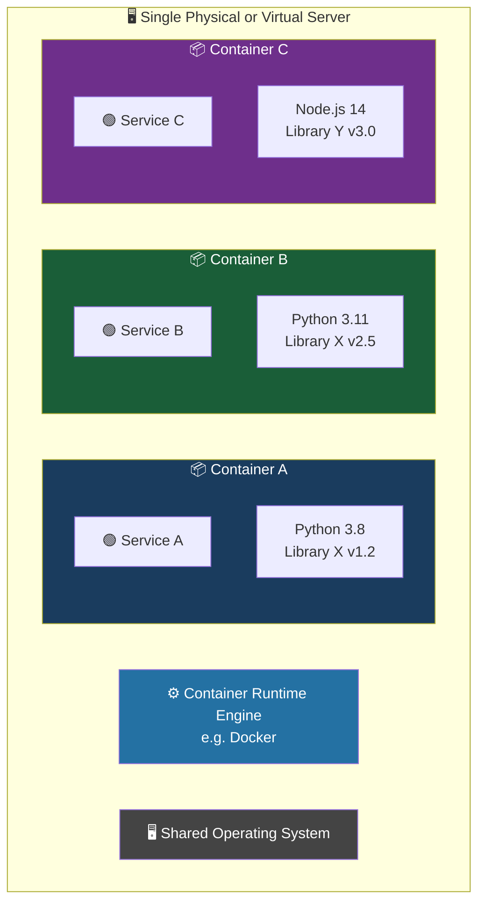
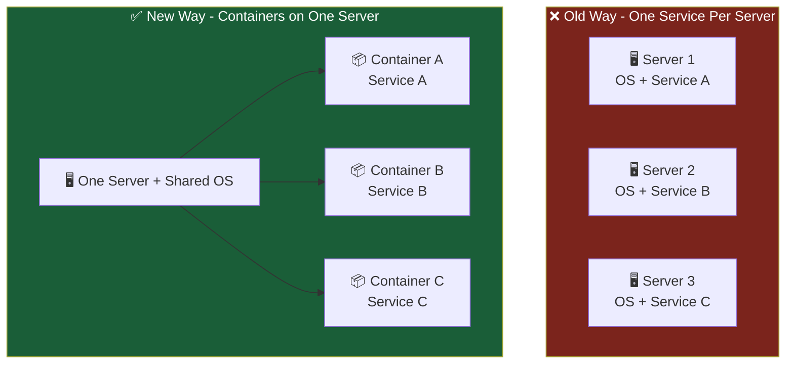
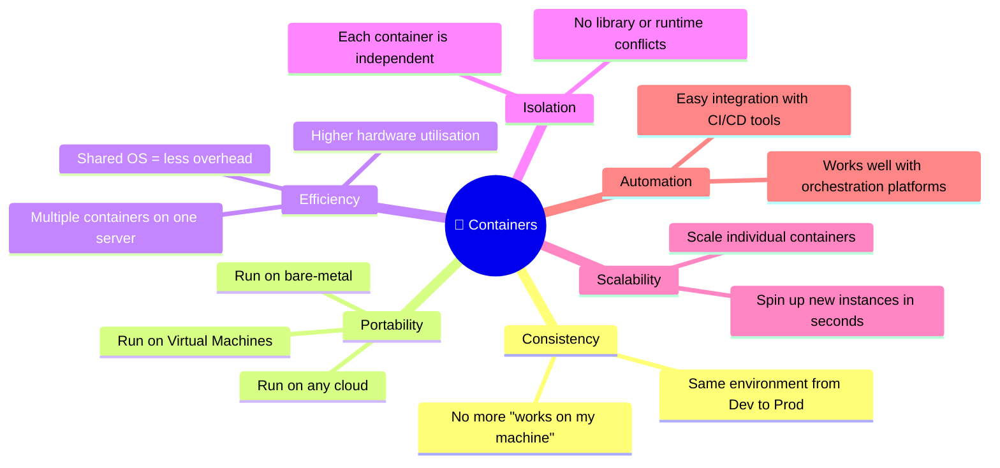

# Challenges — The Road Gets Bumpy

## Not Every Monolith Can Be Saved

Just because incremental refactoring is the preferred path doesn't mean every monolith is a good candidate for it. Some applications are so deeply rooted in outdated technology that refactoring them would cost more time, money, and risk than simply rebuilding from scratch.

Think of it like renovating an old house. Some houses just need a fresh coat of paint and new flooring — totally worth renovating. Others have rotting foundations, asbestos walls, and faulty wiring — at that point, **demolishing and rebuilding is the smarter call**.

### When to Abandon Refactoring and Rebuild

| Situation                       | Why Refactoring Fails Here                                                                      |
| ------------------------------- | ----------------------------------------------------------------------------------------------- |
| Written in COBOL or Assembler   | These languages are extremely difficult to modularise and modern developers rarely know them    |
| Poorly designed architecture    | You can't neatly extract features from spaghetti code — the boundaries don't exist              |
| Tightly coupled to the database | If the app and database are inseparable, you can't extract services without a complete redesign |

_In these cases, the most economical and sensible path is to **design and build a brand new cloud-native application** rather than wrestling with code that was never meant to be broken apart_.

## Challenge 1: Keeping All the Pieces Alive

Once the monolith successfully survives refactoring and becomes a collection of microservices, a new problem emerges — **you now have many independent moving parts that all need to stay running simultaneously**.

In the monolith world, one process ran everything. Now you have dozens of services, and if any one of them crashes or becomes unresponsive, it can cause a ripple effect across the entire application.

Keeping a distributed system healthy requires:

- **Health monitoring** per service
- **Automatic restarts** when a service crashes
- **Circuit breakers** to stop failure from cascading
- **Orchestration tools** to manage the lifecycle of each service

This is a significant operational challenge that didn't exist when everything was one process.

## Challenge 2: The Runtime Conflict Problem

Here's where things get technically interesting. Imagine you've successfully refactored your monolith into 10 microservices and you want to deploy them all on one physical or virtual server to save costs. Sounds efficient, right?

The problem is that different services may need **different versions of the same libraries or runtime environments** — and they'll fight each other.

The workaround? Deploy **one service per server**. But this is wasteful and expensive:

_The OS alone often consumes more memory and CPU than the actual service running on it — you're paying a lot just for the privilege of isolation_.

## The Solution: Application Containers 🐳

Eventually, a technology emerged that solved all of these problems at once — **application containers**.

A container is like a **lightweight, self-contained box** that packages a microservice along with everything it needs to run — its libraries, runtime, and configuration — all bundled together and isolated from everything else on the same server.

Think of it like shipping containers on a cargo ship. Each container holds completely different goods, stacked on the same ship, without any of the contents mixing or interfering with each other. The ship doesn't care what's inside — it just carries them all.

_No conflicts. No version fights. Each container is completely isolated, yet they all share the same underlying server and OS — making hardware usage far more efficient_.

## Containers vs The Old Way

| Feature                 | One Service Per Server      | Containers          |
| ----------------------- | --------------------------- | ------------------- |
| Isolation               | ✅ Full                     | ✅ Full             |
| Resource efficiency     | ❌ Very wasteful            | ✅ Highly efficient |
| OS overhead per service | ❌ Yes — full OS per server | ✅ No — shared OS   |
| Dependency conflicts    | ✅ Avoided                  | ✅ Avoided          |
| Portability             | ❌ Tied to server config    | ✅ Runs anywhere    |
| Scalability             | ❌ Slow, manual             | ✅ Fast, automated  |

## What Containers Bring to the Table

Containers didn't just solve the conflict problem — they unlocked a whole new set of capabilities:

## The Story So Far

_**Key Takeaway**: Refactoring is hard, and not every monolith is worth saving. But for those that make it through, containers provide the missing piece — a lightweight, consistent, portable way to run isolated services on shared hardware without conflict. This sets the stage perfectly for Kubernetes, which answers the next big question: how do you manage all of these containers at scale?_
