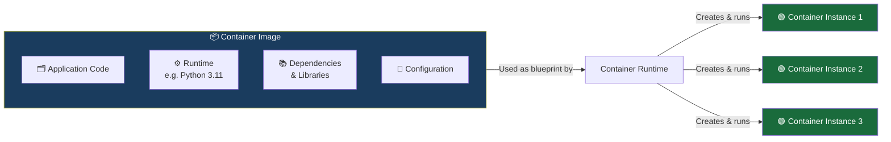
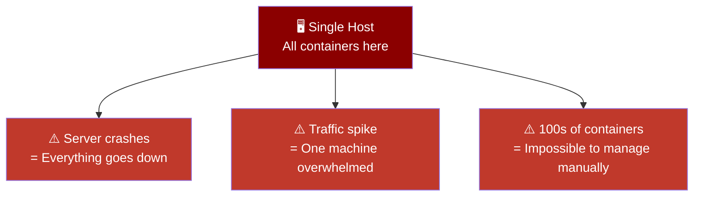
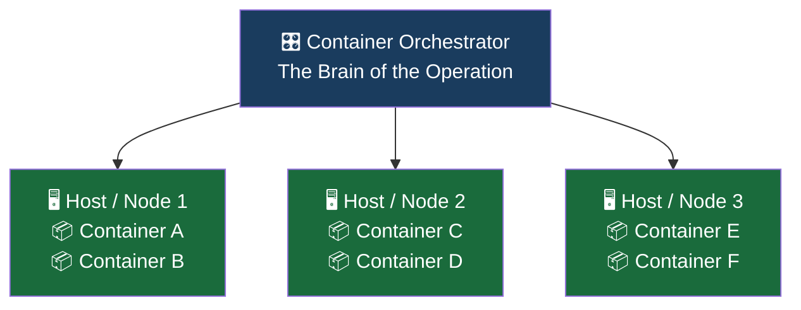

# Overview

## Container Images & Orchestration — Packaging and Managing at Scale

### What is a Container Image?

Before a container can run, it needs a **blueprint** — a pre-packaged snapshot of everything the application needs to exist. That blueprint is called a **container image**.

Think of a container image like a **cooking recipe and all its pre-measured ingredients packed into one box**. The box contains:

- The actual application code
- The runtime it needs to execute (e.g. Python, Node.js, Java)
- All its dependencies and libraries
- Any configuration it relies on

Anyone who gets that box can recreate the exact same dish, every single time, anywhere in the world. That's the power of an image — **consistency and portability, guaranteed**.



_One image → many identical containers. Like a cookie cutter — one mold, infinite cookies_.

## Container Runtimes — The Engine That Brings Images to Life

A container image on its own is just a file. You need a **container runtime** to actually read that image and spin up a live, running container from it. Popular runtimes include:

| Runtime    | What it is                                                                  |
| ---------- | --------------------------------------------------------------------------- |
| runC       | The low-level, bare-bones runtime — the foundation most others are built on |
| containerd | A higher-level runtime used by Docker and Kubernetes under the hood         |
| cri-o      | A lightweight runtime built specifically for Kubernetes                     |

Think of the image as a DVD and the runtime as the DVD player. The player reads the disc and brings the content to life — but it can only do so **on the machine it's installed on**.

```mermaid
graph TD
    IMAGE[📀 Container Image] --> RUNTIME

    subgraph RUNTIME[⚙️ Container Runtime\nrunC · containerd · cri-o]
        direction LR
        R1[\nRead image]
        R2[Set up isolated environment]
        R3[Start the container process]
    end

    RUNTIME --> HOST[🖥️ Single Host Machine\nContainers running here]

    style RUNTIME fill:#2471a3,color:#fff
    style HOST fill:#444,color:#fff
```

## The Single Host Problem

Here's where the limitation surfaces. Container runtimes are great at running containers on **a single machine** — but real-world production systems can't rely on just one server. What happens when:

- That one server goes down? Everything stops.
- Traffic spikes and one server can't keep up? Users suffer.
- You need to run **hundreds of containers** across dozens of services? 🤯 Managing them manually becomes impossible.

Running containers on a single host is fine for development and testing. But for production systems that need to be **reliable**, **scalable**, and **always available**, you need something more.



## The Solution: A Container Orchestrator

The answer is to stop thinking about individual servers and start thinking about a **cluster** — a group of multiple servers connected together and managed as one unified system. At the top of that system sits a **container orchestrator**: a single controller that manages the entire cluster.

The orchestrator's job is to answer questions like:

- Which server should run this container?
- What happens if a container crashes — who restarts it?
- How do containers on different servers find and talk to each other?
- How do we scale up when traffic increases?



_Think of the orchestrator like an **air traffic controller**. Dozens of planes (containers) are in the air at any moment across multiple runways (servers). The controller doesn't fly any of the planes — it monitors everything, makes decisions, reroutes when needed, and ensures nothing crashes into anything else_.

## How It All Connects


## Summary

| Concept                    | What it Does                           | Analogy                                   |
| -------------------------- | -------------------------------------- | ----------------------------------------- |
| **Container Image**        | Packages app + runtime + dependencies  | Recipe box with pre-measured ingredients  |
| **Container Runtime**      | Reads the image and runs the container | DVD player reading the disc               |
| **Single Host**            | Runs containers on one machine         | One kitchen cooking everything            |
| **Container Orchestrator** | Manages containers across many hosts   | Air traffic controller across all runways |

**Key Takeaway**: Container images solve the packaging problem — consistent, portable, reproducible environments. Container runtimes solve the execution problem — bringing those images to life. But neither solves the scale and resilience problem. That's exactly what a **container orchestrator** like Kubernetes is built for — and it's what the rest of this course is all about.
