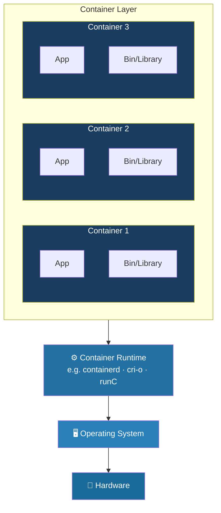
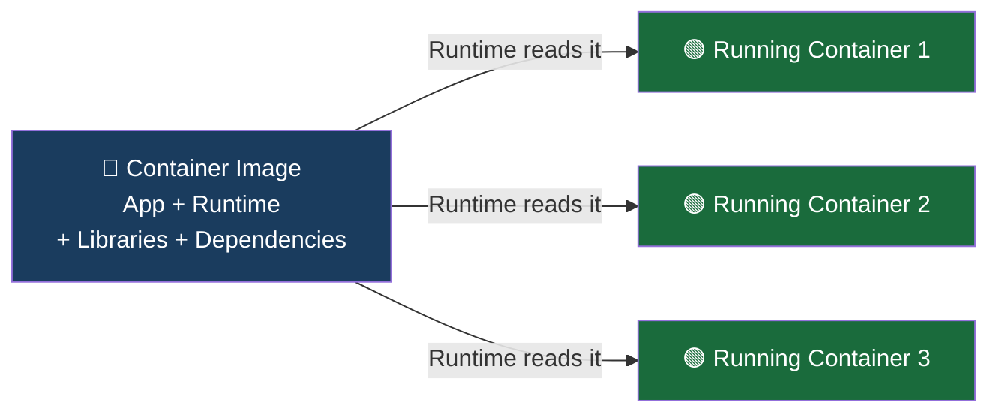
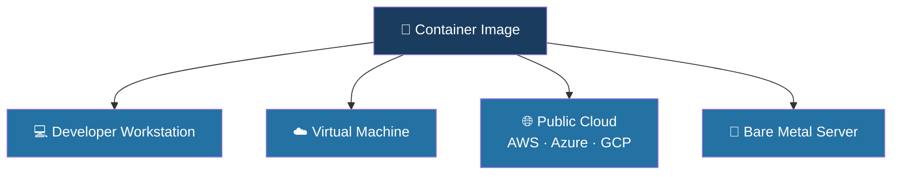
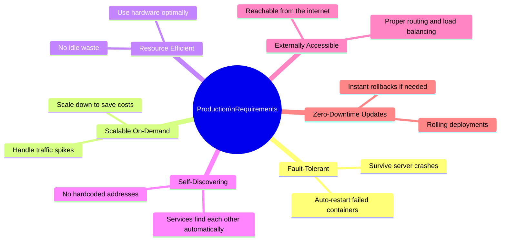
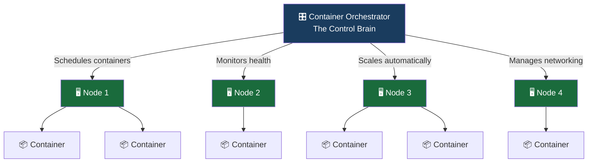
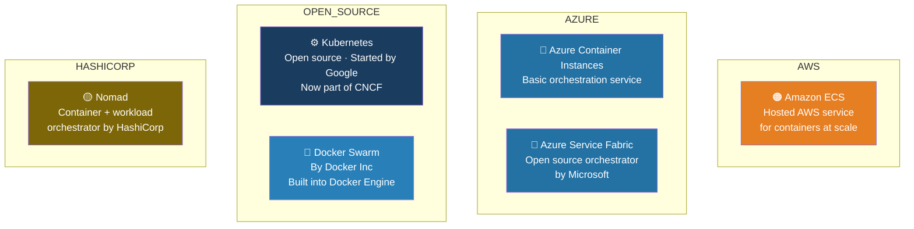
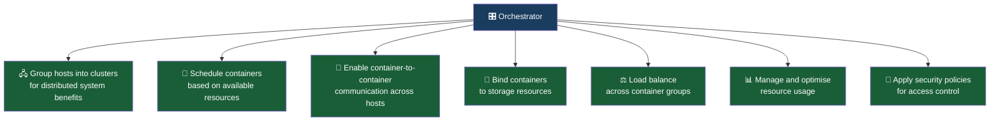
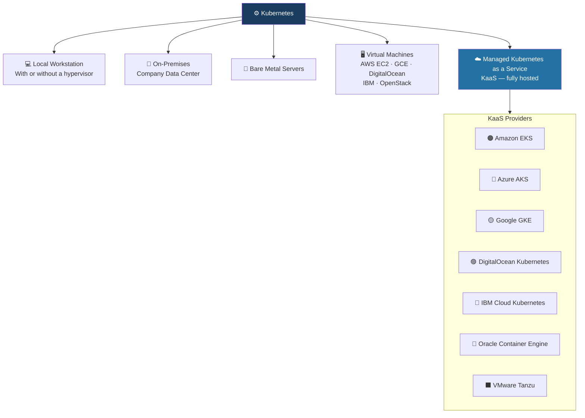

# What Are Containers? 🐳

### The Simple Explanation

A container is an **application-centric, self-contained unit** that packages everything an app needs to run — and then isolates it from everything else on the same machine.

Think of a container like a **packed lunch box**. Everything you need for lunch is inside — the food, the utensils, the napkin. It doesn't matter if you eat it at your desk, in the park, or on a train. The contents are the same, the experience is consistent, and your lunch doesn't interfere with anyone else's.

That's what containers do for software — they make applications **portable**, **isolated**, and **consistent** across any infrastructure.

### How Containers Are Structured

The image below shows exactly how containers sit on top of your infrastructure:

**App** → sits inside a **Container** (with its own Bin/Library) → managed by the **Container Runtime** → running on the **Operating System** → on top of **Hardware**.

_Key insight: all three containers **share the same OS and hardware**, but each one is completely isolated from the others. No conflicts, no interference_.

## Containers vs Container Images — What's the Difference?

|                 | Container Image             | Container                                  |
| --------------- | --------------------------- | ------------------------------------------ |
| **What is it?** | A static blueprint/snapshot | A live, running instance of that blueprint |
| **Analogy**     | A recipe                    | The actual cooked meal                     |
| **State**       | Doesn't change              | Active, can have state while running       |
| **Created by**  | Developers / CI pipelines   | Container runtime reading the image        |

_Containers **run** container images. The image is the blueprint — the container is the thing that's actually alive_.

## Where Can Containers Run?

Because the image bundles everything the app needs, it can run on virtually any platform without modification:

_Same image. Any platform. Always consistent. This is what "write once, run anywhere" actually looks like in practice_.

## What Is Container Orchestration?

### When a Single Host Isn't Enough

Running a couple of containers on your laptop during development? Easy. But the moment you move to a real production environment, the rules change completely.

Production applications need to be:

A single host simply cannot provide all of these. You need a cluster — multiple servers working as one — and something to manage it all.

That something is a **Container Orchestrator**.

## What Does an Orchestrator Actually Do?

An orchestrator groups multiple servers into a cluster and then **automates everything** about how containers are deployed and managed across that cluster.

_The benefits of this clustered, distributed approach include higher performance, better cost efficiency, improved reliability, smart workload distribution, and reduced latency — things one server simply cannot offer_.

## Container Orchestrators — Who Are the Players?

As containerisation took off, many orchestration tools emerged to meet the demand. Here's a quick map of the landscape:

_Many of these are re-distributions or managed versions of existing tools, packaged with extra features. Some trade flexibility for simplicity. **Kubernetes** stands out as the most widely adopted, open, and flexible of them all_.

## What Can Orchestrators Do?

Here's what most container orchestrators are capable of — and why managing containers manually at scale would be a nightmare without them:

_Without an orchestrator, managing hundreds of containers manually across dozens of servers would mean writing complex scripts, watching for failures yourself, and manually rebalancing workloads. Orchestrators make all of that automatic_.

## Where Can You Deploy an Orchestrator?

One of the great things about container orchestrators — especially Kubernetes — is that they're not tied to any one environment. You can deploy them almost anywhere:

### Self-Managed vs Managed (KaaS)

|                            | Self-Managed                    | Managed KaaS                 |
| -------------------------- | ------------------------------- | ---------------------------- |
| **You control**            | Everything — infra + Kubernetes | Just your apps               |
| **Cloud provider handles** | Nothing                         | The Kubernetes control plane |
| **Complexity**             | Higher                          | Much lower                   |
| **Flexibility**            | Maximum                         | Slightly limited             |
| **Best for**               | Advanced teams, custom needs    | Most enterprises and teams   |
| **Examples**               | Kubernetes on EC2/GCE           | EKS, AKS, GKE                |

_**KaaS** solutions let you spin up a production-ready Kubernetes cluster with just a few commands — no need to manage the underlying infrastructure yourself_.

## The Big Picture — Where We Are in the Journey

**Key Takeaway**: Containers solve the packaging and isolation problem. Container orchestrators solve the management at scale problem. Together, they form the foundation of modern cloud-native infrastructure — and Kubernetes is the industry-standard tool that brings it all together. Everything from here builds on this foundation.
