# What Is Kubernetes? ⚙️

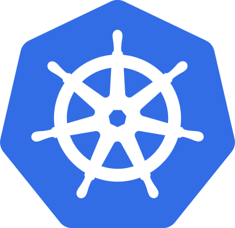

### The Simple Explanation

Kubernetes is an **open-source system for automating the deployment, scaling, and management of containerised applications**. But what does that actually mean in plain terms?

Imagine you're the captain of a massive cargo ship carrying hundreds of shipping containers. You need to know which containers go where, what to do if one falls overboard, how to rebalance the load when the ship tilts, and how to efficiently use every inch of deck space. Managing all of that manually would be chaos.

**Kubernetes is the helmsman of that ship**. In fact, the word _Kubernetes_ (κυβερνήτης) is ancient Greek for _helmsman or ship pilot_ — the person who steers the vessel and keeps everything on course.

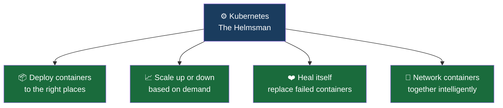

_Fun fact: Kubernetes is also written as **k8s** — because there are exactly 8 letters between the k and the s. Pronounced "Kate's"_.

## A Brief History — From Google Borg to Kubernetes

Kubernetes didn't appear out of nowhere. It was born from over a decade of hard-won experience inside Google.

Google runs some of the world's largest services — Gmail, Maps, Drive, Docs, YouTube. All of them have been powered behind the scenes by a system called **Borg** — Google's internal container orchestrator, running hundreds of thousands of jobs across tens of thousands of machines per cluster.

Borg was Google's secret weapon. And when some of the engineers who built it left to create Kubernetes, they brought all of that knowledge with them.

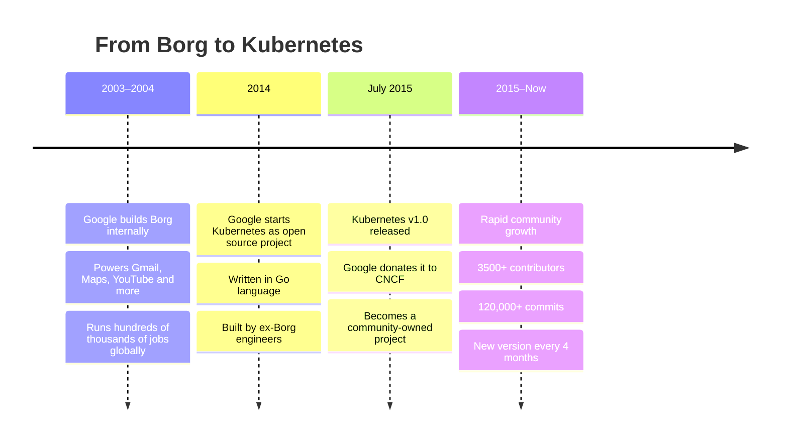

Several core Kubernetes concepts trace directly back to lessons learned from Borg:

| Kubernetes Feature | Borg Origin                           |
| ------------------ | ------------------------------------- |
| **API Server**     | Central control interface             |
| **Pods**           | Borg's concept of grouped containers  |
| **IP-per-Pod**     | Network isolation model               |
| **Services**       | Named, stable endpoints for apps      |
| **Labels**         | Metadata-based grouping and selection |

## Kubernetes Features

### The Core Capabilities

Kubernetes ships with a remarkably rich feature set. Here's an intuitive breakdown of what it can do:

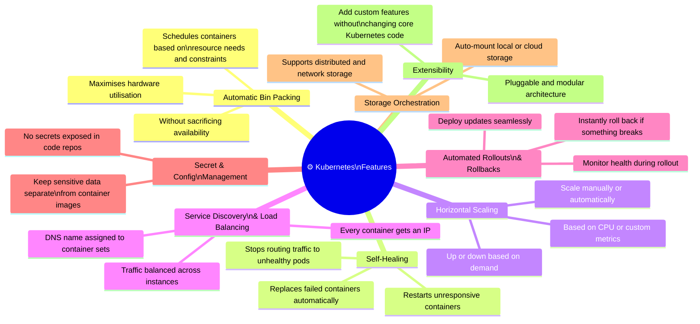

## Feature Deep-Dives

### 1. Automatic Bin Packing

Kubernetes looks at all your containers and all your available nodes (servers), then **intelligently decides which container goes on which node** to make the best use of available CPU and memory — like a smart game of Tetris.

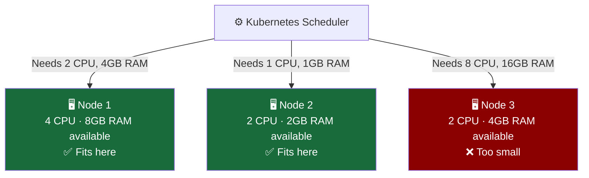

### 2. Self-Healing

If a container crashes, becomes unresponsive, or the node it's running on dies — Kubernetes **notices immediately and takes action** without any human intervention.

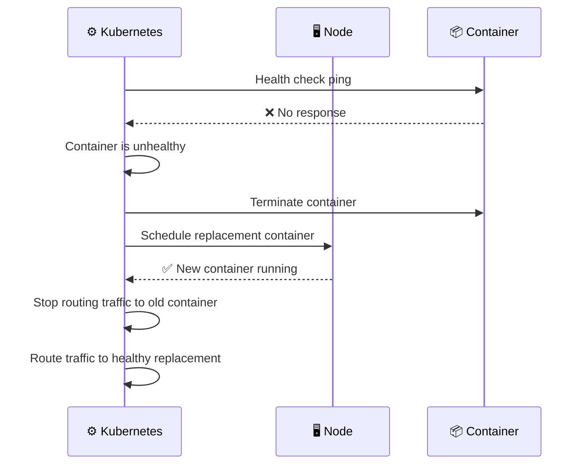

### 3. Horizontal Scaling

Instead of making one container bigger (vertical scaling), Kubernetes **adds more copies of it** (horizontal scaling) to handle increased load — and removes them when load drops.

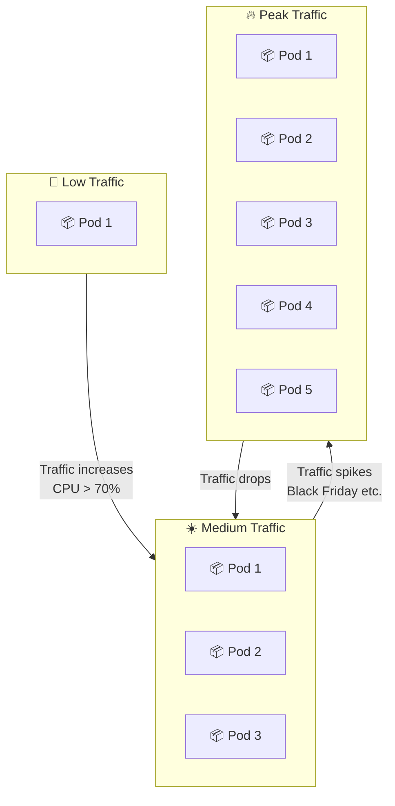

### 4. Automated Rollouts & Rollbacks

Updating an app in Kubernetes is done **one pod at a time** — so users never experience downtime. If the new version has a problem, Kubernetes can instantly roll back to the previous version.

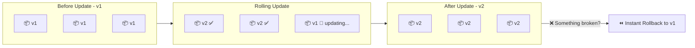

## Why Use Kubernetes?

Three words summarise Kubernetes' appeal: **portability**, **extensibility**, and **community**.

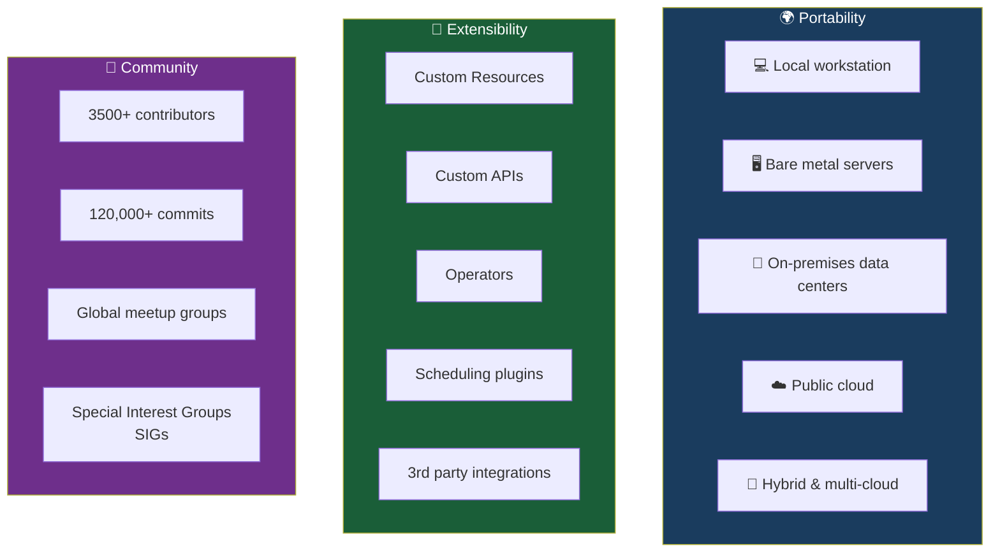

_Kubernetes doesn't just orchestrate microservices — its **own architecture is built like microservices**. **Modular**, **decoupled**, and **pluggable**. It practises what it preaches_.

## Who Is Using Kubernetes?

Kubernetes is not a niche tool for tech startups. It powers workloads across almost every major industry:

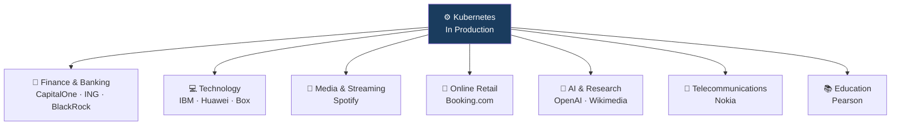

## The Cloud Native Computing Foundation (CNCF)

### What is CNCF?

When Google donated Kubernetes in 2015, it didn't hand it to another company — it gave it to a **neutral**, **community-run foundation**: the **Cloud Native Computing Foundation (CNCF)**, a sub-project of the Linux Foundation.

CNCF's mission is to accelerate the adoption of containers, microservices, and cloud-native applications — and it does that by hosting and nurturing the ecosystem of tools that make cloud-native development possible.

Think of CNCF like a **national park service for open-source projects** — it provides the land, the infrastructure, and the rules to keep everything healthy and accessible, while the individual projects (the wildlife) continue to thrive on their own terms.

## CNCF Project Maturity Levels

Not all projects in CNCF are equally mature. They move through three stages:

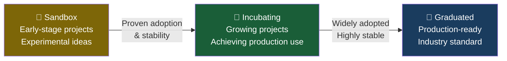

## Key CNCF Graduated Projects

These are the tools that have proven themselves in production across the industry:

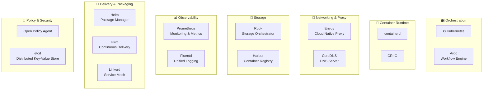

## What CNCF Does for Kubernetes Specifically

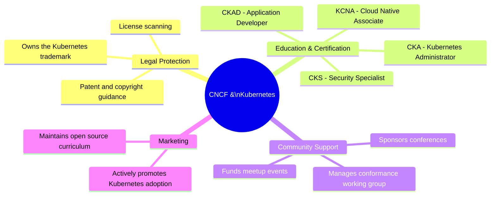

## The Full Cloud-Native Ecosystem at a Glance

```mermaid
graph LR
    CODE[👨‍💻 Write Code]
    -->|Package with| BUILD[📀 Container Image\ncontainerd · CRI-O]
    -->|Deploy with| ORCH[⚙️ Kubernetes\nOrchestration]
    -->|Manage config with| HELM[📦 Helm\nPackaging]
    -->|Monitor with| PROM[📊 Prometheus\nMonitoring]
    -->|Log with| FLUID[📋 Fluentd\nLogging]
    -->|Secure with| OPA2[🔐 OPA\nPolicy]
    -->|Deliver via| FLUX2[🚀 Flux\nCI/CD]

    style CODE fill:#444,color:#fff
    style BUILD fill:#1a3c5e,color:#fff
    style ORCH fill:#1a6b3c,color:#fff
    style HELM fill:#e67e22,color:#fff
    style PROM fill:#c0392b,color:#fff
    style FLUID fill:#6e2f8b,color:#fff
    style OPA2 fill:#2471a3,color:#fff
    style FLUX2 fill:#1a5e38,color:#fff
```

_CNCF projects cover the entire lifecycle of a cloud-native application — from building and running it, to monitoring, securing, and delivering it continuously_.

## Summary

| Topic                       | Key Takeaway                                                               |
| --------------------------- | -------------------------------------------------------------------------- |
| **What is Kubernetes?**     | The open-source helmsman for containerised applications                    |
| **Where did it come from?** | Born from Google's internal Borg system                                    |
| **What can it do?**         | Auto-deploy, scale, heal, route, secure, and manage containers             |
| **Who uses it?**            | Banks, retailers, tech giants, AI companies, telecoms — everyone           |
| **What is CNCF?**           | The neutral foundation that owns and nurtures Kubernetes and its ecosystem |
| **Why does CNCF matter?**   | It ensures Kubernetes stays open, vendor-neutral, and community-driven     |

**Key Takeaway**: Kubernetes is not just a tool — it's the centre of an entire ecosystem. CNCF wraps around it with complementary tools for every layer of cloud-native development. Together, they form the backbone of modern infrastructure at scale. Now that you understand what Kubernetes is and why it exists, the next step is understanding how it actually works — its architecture.
