# Kubernetes Architecture

### The Big Picture

At its core, a Kubernetes cluster is simply a group of computers (called **nodes**) divided into two distinct roles — those that **manage the cluster**, and those that **run the work**.

Think of it like a restaurant. The **kitchen manager** (Control Plane) decides what gets cooked, who cooks it, and monitors quality. The **chefs** (Worker Nodes) are the ones actually doing the cooking. The manager never cooks — they orchestrate. The chefs never manage — they execute.

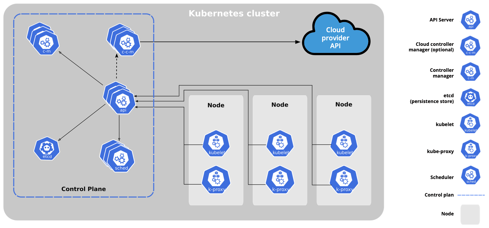

_Image shows the full cluster layout — a Control Plane on the left housing the API server, scheduler, controller managers, and etcd, with Worker Nodes on the right each running a kubelet and kube-proxy, all optionally connected to a Cloud Provider API_.

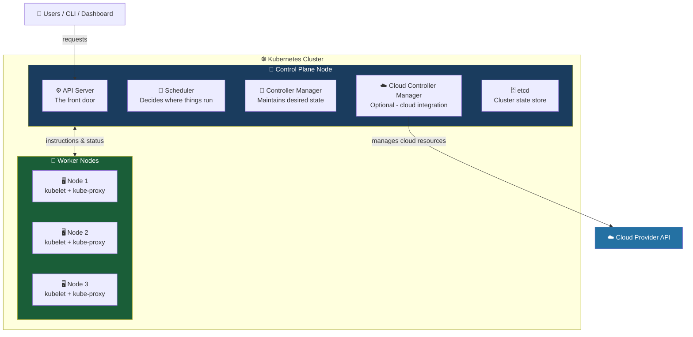
```mermaid
graph TD
    subgraph CLUSTER[☸️ Kubernetes Cluster]
        subgraph CP[🧠 Control Plane Node]
            API[⚙️ API Server\nThe front door]
            SCHED[📅 Scheduler\nDecides where things run]
            CM[🔄 Controller Manager\nMaintains desired state]
            CCM[☁️ Cloud Controller Manager\nOptional - cloud integration]
            ETCD[🗄️ etcd\nCluster state store]
        end

        subgraph WORKERS[💪 Worker Nodes]
            W1[🖥️ Node 1\nkubelet + kube-proxy]
            W2[🖥️ Node 2\nkubelet + kube-proxy]
            W3[🖥️ Node 3\nkubelet + kube-proxy]
        end

        CP <-->|instructions & status| WORKERS
    end

    USERS[👥 Users / CLI / Dashboard] -->|requests| API
    CCM -->|manages cloud resources| CLOUD[☁️ Cloud Provider API]

    style CP fill:#1a3c5e,color:#fff
    style WORKERS fill:#1a5e38,color:#fff
    style CLOUD fill:#2471a3,color:#fff
```

## The Control Plane — The Brain of the Cluster

### What Does the Control Plane Do?

The control plane is responsible for **managing the entire cluster's state**. It doesn't run your applications — it decides _how_, _where_, and when they run. Every **decision**, every **scheduling call**, every **health check** and **recovery action** originates here.

Users interact with the control plane through:

- **kubectl** — a command line tool.
- **Web UI Dashboard** — a browser-based interface.
- **API calls** — direct programmatic access.

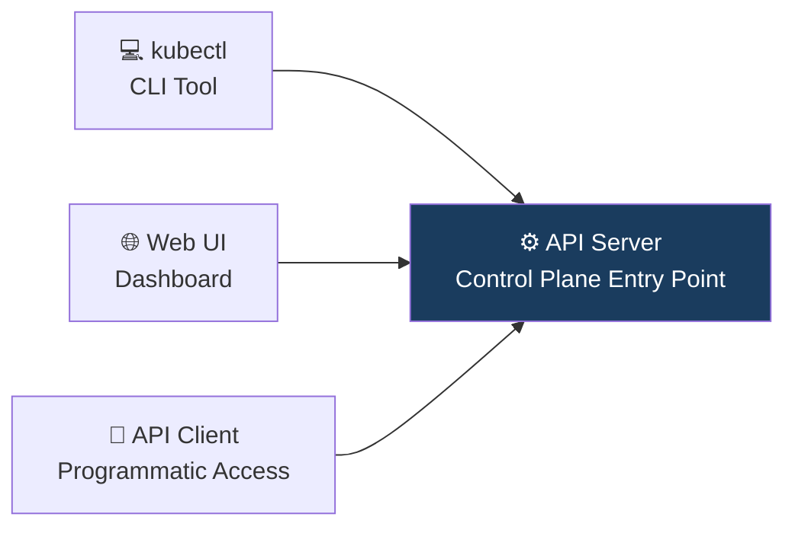
```mermaid
graph LR
    CLI[💻 kubectl\nCLI Tool]
    WEB[🌐 Web UI\nDashboard]
    API_CLIENT[🔌 API Client\nProgrammatic Access]

    CLI --> APISERVER[⚙️ API Server\nControl Plane Entry Point]
    WEB --> APISERVER
    API_CLIENT --> APISERVER

    style APISERVER fill:#1a3c5e,color:#fff
```

### High Availability — Never Losing the Brain

Losing the control plane means losing the ability to manage the cluster — a serious risk. To prevent this, you can **run multiple control plane replicas** in High Availability (HA) mode. Only one is active at a time, but the others are in sync and ready to take over instantly if the active one fails.

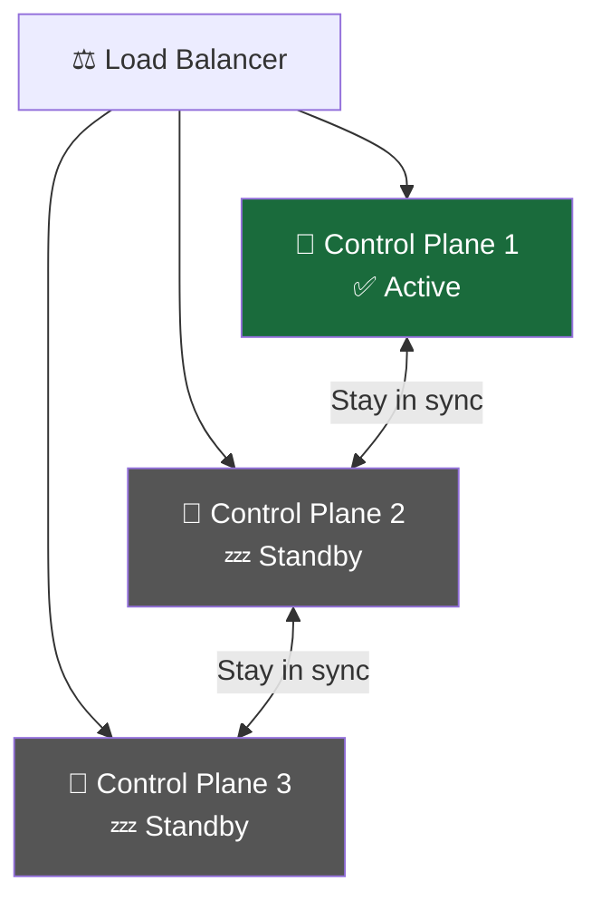
```mermaid
graph TD
    LB[⚖️ Load Balancer]

    LB --> CP1[🧠 Control Plane 1\n✅ Active]
    LB --> CP2[🧠 Control Plane 2\n💤 Standby]
    LB --> CP3[🧠 Control Plane 3\n💤 Standby]

    CP1 <-->|Stay in sync| CP2
    CP2 <-->|Stay in sync| CP3

    style CP1 fill:#1a6b3c,color:#fff
    style CP2 fill:#555,color:#fff
    style CP3 fill:#555,color:#fff
```

## Control Plane Components

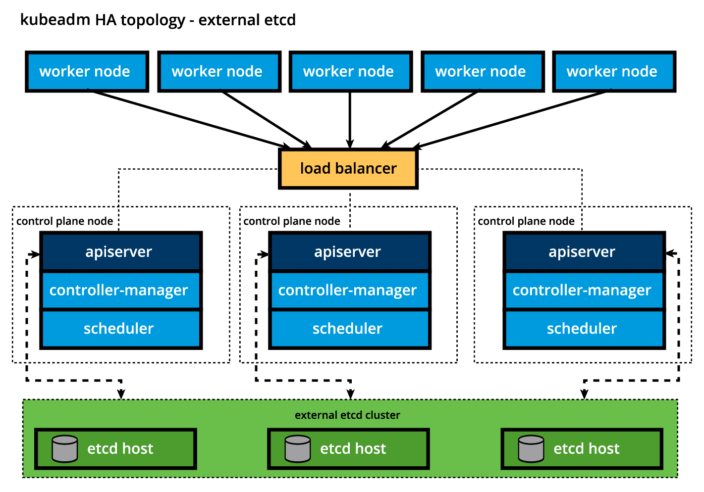

### 1. The API Server — The Front Door

Every single thing that happens in Kubernetes goes through the **API Server**. It's the only component that reads from and writes to etcd (the cluster's database). Think of it as the **reception desk** of the entire cluster — nothing gets in or out without going through it.

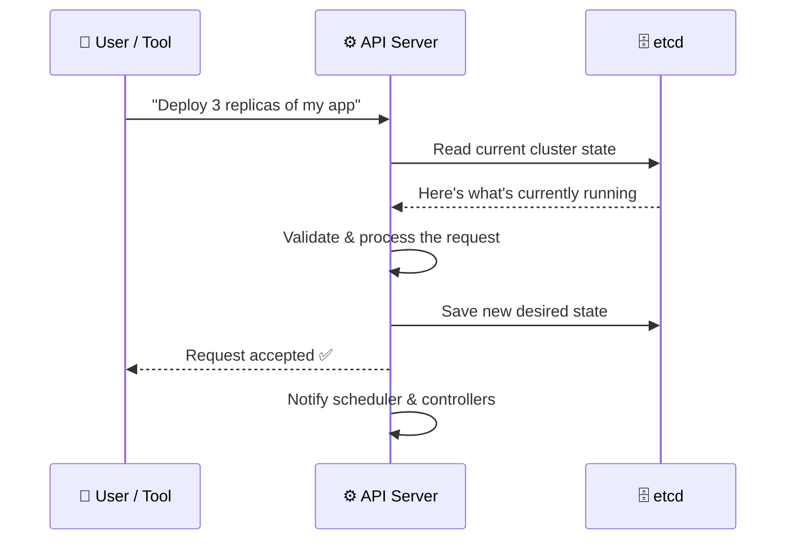
```mermaid
sequenceDiagram
    participant U as 👥 User / Tool
    participant A as ⚙️ API Server
    participant E as 🗄️ etcd

    U->>A: "Deploy 3 replicas of my app"
    A->>E: Read current cluster state
    E-->>A: Here's what's currently running
    A->>A: Validate & process the request
    A->>E: Save new desired state
    A-->>U: Request accepted ✅
    A->>A: Notify scheduler & controllers
```

**Key traits**:

- **Only** component that talks to etcd.
- Intercepts and validates all **RESTful API calls**.
- Horizontally scalable — you can run multiple API server instances.
- Supports custom secondary API servers for advanced use cases.

### 2. The Scheduler — The Matchmaker

The scheduler's job is simple to describe but complex to execute: **look at a new workload and decide which node it should run on**.

It's like a hotel concierge assigning guests to rooms — it knows which rooms are available, which guests have special requirements (wheelchair access, high floor, quiet room), and makes the best possible match.

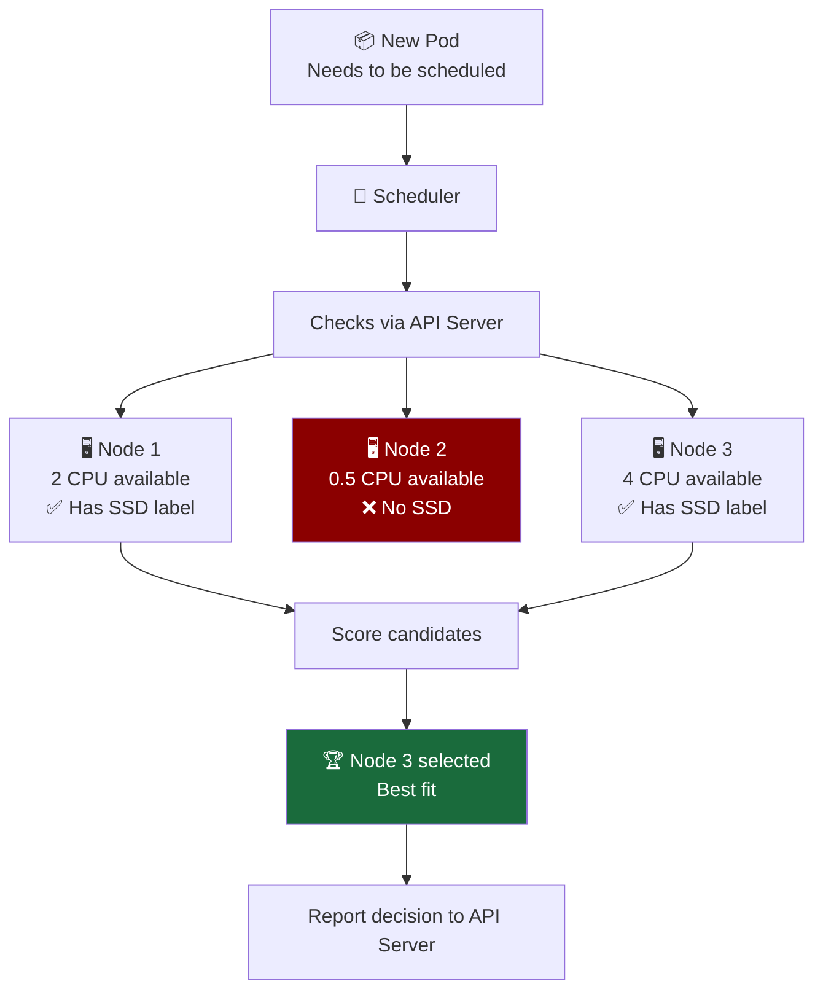
```mermaid
graph TD
    NEW[📦 New Pod\nNeeds to be scheduled]

    NEW --> SCHED[📅 Scheduler]

    SCHED --> CHECK[Checks via API Server]
    CHECK --> N1[🖥️ Node 1\n2 CPU available\n✅ Has SSD label]
    CHECK --> N2[🖥️ Node 2\n0.5 CPU available\n❌ No SSD]
    CHECK --> N3[🖥️ Node 3\n4 CPU available\n✅ Has SSD label]

    N1 --> SCORE[Score candidates]
    N3 --> SCORE
    SCORE --> WINNER[🏆 Node 3 selected\nBest fit]
    WINNER --> API[Report decision to API Server]

    style WINNER fill:#1a6b3c,color:#fff
    style N2 fill:#8B0000,color:#fff
```

**The scheduler considers many factors**:

- Available CPU and memory on each node.
- Custom labels and constraints (e.g. `disk==ssd`).
- Quality of Service requirements.
- Data locality, affinity and anti-affinity rules.
- Taints and tolerations.
- Cluster topology.

### 3. Controller Managers — The Watchdogs

Controllers are **continuous watch-loop processes** that keep asking one question: "_Is the current state of the cluster the same as the desired state?_" If not, they take action to fix it.

Think of them like a **thermostat** — you set the temperature you want (desired state), and the thermostat constantly checks the actual temperature (current state) and turns heating or cooling on/off to match.

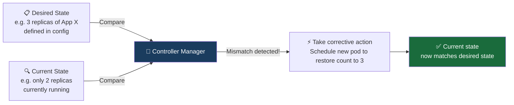
```mermaid
graph LR
    DESIRED[📋 Desired State\ne.g. 3 replicas of App X\ndefined in config]
    ACTUAL[🔍 Current State\ne.g. only 2 replicas\ncurrently running]

    DESIRED -->|Compare| CONTROLLER[🔄 Controller Manager]
    ACTUAL -->|Compare| CONTROLLER

    CONTROLLER -->|Mismatch detected!| ACTION[⚡ Take corrective action\nSchedule new pod to restore count to 3]
    ACTION --> MATCH[✅ Current state\nnow matches desired state]

    style CONTROLLER fill:#1a3c5e,color:#fff
    style MATCH fill:#1a6b3c,color:#fff
```

**There are two controller managers**:

| Controller Manager           | What It Handles                                                                     |
| ---------------------------- | ----------------------------------------------------------------------------------- |
| **kube-controller-manager**  | Node availability, pod counts, endpoints, service accounts, API tokens              |
| **cloud-controller-manager** | Cloud provider resources — load balancers, storage volumes, unavailable cloud nodes |

### 4. etcd — The Cluster's Memory

**etcd** is the distributed key-value store where **all cluster state is saved**. It's the single source of truth for everything Kubernetes knows about itself.

Think of it as the cluster's **long-term memory** — if etcd disappears, the cluster loses all knowledge of what's supposed to be running, where, and how. That's why protecting etcd is critical.

Key facts about etcd:

- Only the API Server talks directly to it.
- Data is **append-only** — nothing is overwritten, only added; old data is periodically compacted.
- Uses the **Raft Consensus Algorithm** for distributed reliability.
- Stores: **cluster state**, **subnets**, **ConfigMaps**, **Secrets**, and more

**The Raft Consensus Algorithm — Staying Consistent Across Multiple etcd Nodes.**
When etcd runs as a cluster (which it should in production), it uses Raft to elect a **leader** node that coordinates all writes, while **follower** nodes stay in sync.

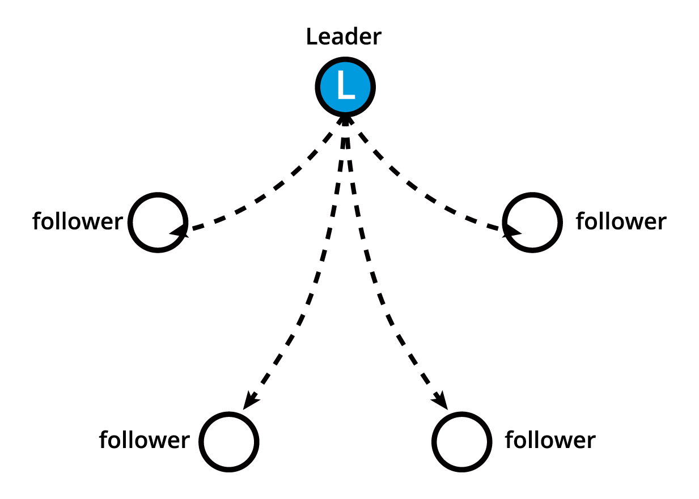

_Image 3 shows this leader/follower model — one elected leader pushes updates to all followers via dashed sync lines_.

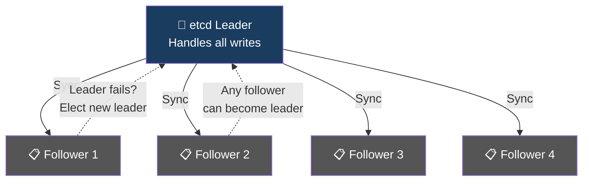
```mermaid
graph TD
    LEADER[👑 etcd Leader\nHandles all writes]

    LEADER -->|Sync| F1[📋 Follower 1]
    LEADER -->|Sync| F2[📋 Follower 2]
    LEADER -->|Sync| F3[📋 Follower 3]
    LEADER -->|Sync| F4[📋 Follower 4]

    F1 -.->|Leader fails?\nElect new leader| LEADER
    F2 -.->|Any follower\ncan become leader| LEADER

    style LEADER fill:#1a3c5e,color:#fff
    style F1 fill:#555,color:#fff
    style F2 fill:#555,color:#fff
    style F3 fill:#555,color:#fff
    style F4 fill:#555,color:#fff
```

_Unlike a primary/secondary setup, **no node is permanently favoured**. If the leader fails, any healthy follower can be elected as the new leader_.

**etcd Topology — Where Does It Live?**

**Stacked etcd**: etcd runs on the same control plane nodes. Simpler, but if the control plane node goes down, you lose both the control plane components and the data store together.

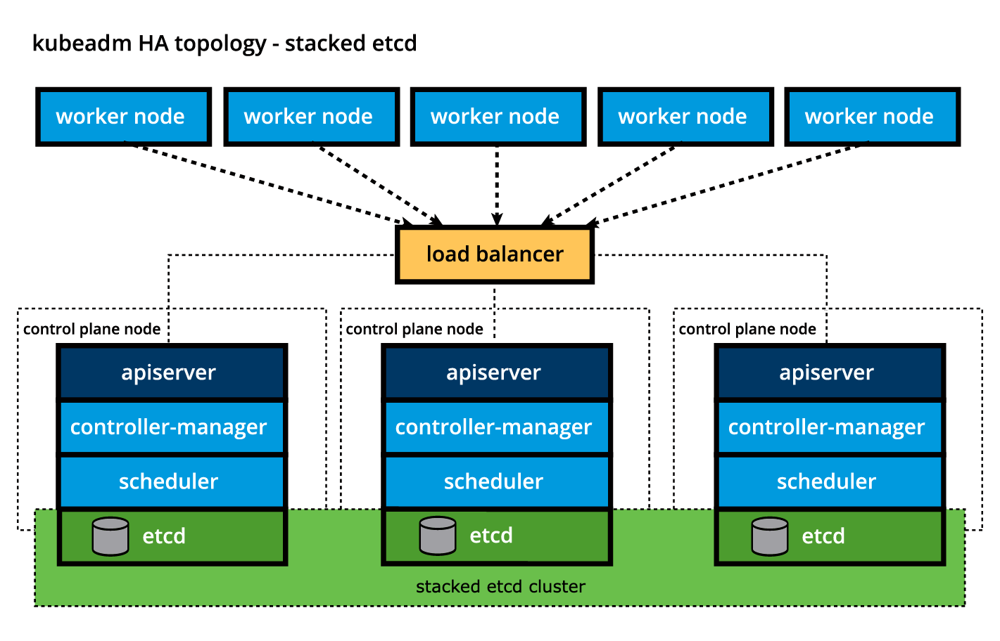

**External etcd**: etcd runs on its own dedicated hosts, completely separate from the control plane. More resilient, but requires extra hardware and cost.

**Stacked vs External**

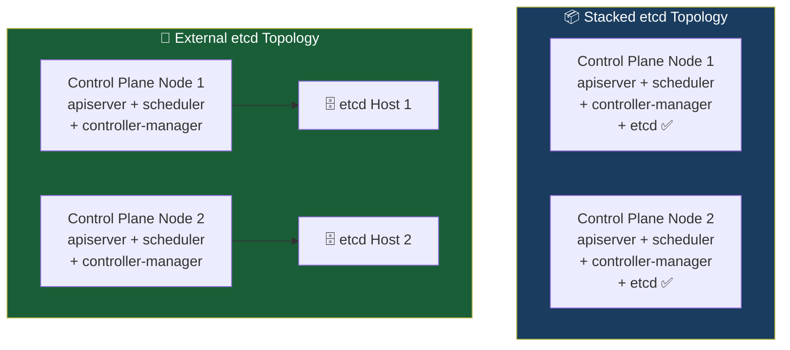
```mermaid
graph TD
    subgraph STACKED[📦 Stacked etcd Topology]
        CPN1[Control Plane Node 1\napiserver + scheduler\n+ controller-manager\n+ etcd ✅]
        CPN2[Control Plane Node 2\napiserver + scheduler\n+ controller-manager\n+ etcd ✅]
    end

    subgraph EXTERNAL[🔀 External etcd Topology]
        CPN3[Control Plane Node 1\napiserver + scheduler\n+ controller-manager]
        CPN4[Control Plane Node 2\napiserver + scheduler\n+ controller-manager]
        ETCD1[🗄️ etcd Host 1]
        ETCD2[🗄️ etcd Host 2]
        CPN3 --> ETCD1
        CPN4 --> ETCD2
    end

    style STACKED fill:#1a3c5e,color:#fff
    style EXTERNAL fill:#1a5e38,color:#fff
```

|                   | Stacked etcd            | External etcd            |
| ----------------- | ----------------------- | ------------------------ |
| **etcd location** | On control plane node   | Dedicated separate hosts |
| **Complexity**    | Lower                   | Higher                   |
| **Resilience**    | Good (HA replicas help) | Better (fully decoupled) |
| **Cost**          | Lower                   | Higher (extra hardware)  |

## Worker Nodes — Where the Work Happens

### What is a Worker Node?

Worker nodes are the machines that actually **run your application containers**. They receive instructions from the control plane and execute them — **starting pods**, **running containers**, **managing networking**, and **reporting back on health**.

In a multi-worker cluster, network traffic from users goes **directly to the worker nodes** — it never has to pass through the control plane.

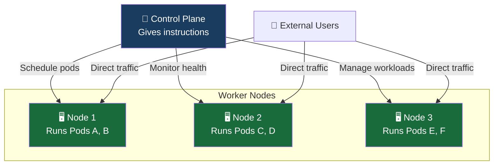
```mermaid
graph TD
    CP[🧠 Control Plane\nGives instructions]

    CP -->|Schedule pods| W1
    CP -->|Monitor health| W2
    CP -->|Manage workloads| W3

    subgraph WORKERS[Worker Nodes]
        W1[🖥️ Node 1\nRuns Pods A, B]
        W2[🖥️ Node 2\nRuns Pods C, D]
        W3[🖥️ Node 3\nRuns Pods E, F]
    end

    USERS[👥 External Users] -->|Direct traffic| W1
    USERS -->|Direct traffic| W2
    USERS -->|Direct traffic| W3

    style CP fill:#1a3c5e,color:#fff
    style W1 fill:#1a6b3c,color:#fff
    style W2 fill:#1a6b3c,color:#fff
    style W3 fill:#1a6b3c,color:#fff
```

## Worker Node Components

### 1. Container Runtime — The Engine

Kubernetes itself **cannot run containers** — it needs a container runtime installed on every node to do that on its behalf. The runtime manages the full container lifecycle: _pulling images_, _starting containers_, _stopping containers_, and _cleaning up_.

**Supported runtimes**:

| Runtime                        | Notes                                          |
| ------------------------------ | ---------------------------------------------- |
| **CRI-O**                      | Lightweight, built specifically for Kubernetes |
| **containerd**                 | Simple, robust, widely used                    |
| **Docker Engine**              | Popular, uses containerd internally            |
| **Mirantis Container Runtime** | Enterprise-grade, formerly Docker EE           |

### 2. kubelet — The Node Agent

The **kubelet** is the agent that runs on **every node** (including the control plane) and acts as the bridge between the control plane and the container runtime. It's the node's local manager.

Think of the kubelet as the **site foreman** on a construction site. The control plane is the architect sending blueprints (Pod definitions). The kubelet receives those blueprints and tells the workers (container runtime) exactly what to build.

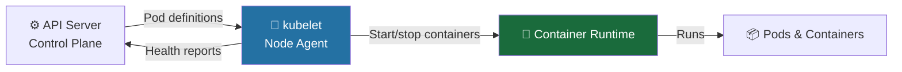
```mermaid
graph LR
    API[⚙️ API Server\nControl Plane] -->|Pod definitions| KUBELET[🔧 kubelet\nNode Agent]
    KUBELET -->|Start/stop containers| RUNTIME[🐳 Container Runtime]
    RUNTIME -->|Runs| PODS[📦 Pods & Containers]
    KUBELET -->|Health reports| API

    style KUBELET fill:#2471a3,color:#fff
    style RUNTIME fill:#1a6b3c,color:#fff
```

**How kubelet Talks to the Runtime — The CRI**

Rather than being hardcoded to one runtime, kubelet uses a standard interface called the **Container Runtime Interface (CRI)**. Any runtime that implements CRI can plug into kubelet — making the system flexible and extensible.

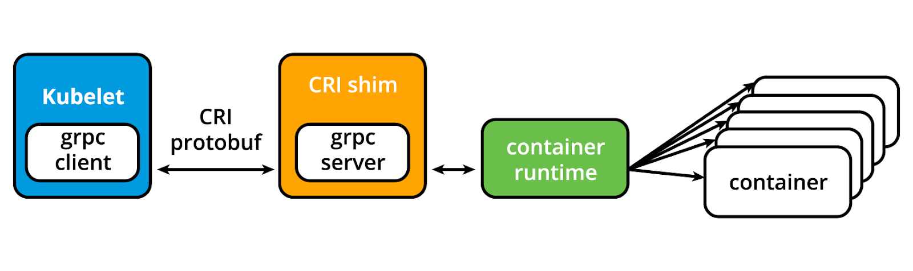

_Image 4 shows this: **kubelet** (as a gRPC client) talks to a **CRI** shim (gRPC server), which then communicates with the actual **container runtime** to manage containers_.

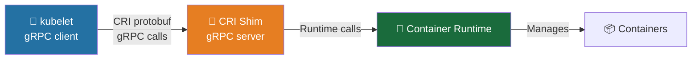
```mermaid
graph LR
    KB[🔧 kubelet\ngRPC client]
    -->|CRI protobuf\ngRPC calls| SHIM[🔌 CRI Shim\ngRPC server]
    -->|Runtime calls| RT[🐳 Container Runtime]
    -->|Manages| C[📦 Containers]

    style KB fill:#2471a3,color:#fff
    style SHIM fill:#e67e22,color:#fff
    style RT fill:#1a6b3c,color:#fff
```

The CRI implements two services:

- **ImageService** — handles pulling, listing, and removing container images
- **RuntimeService** — handles Pod and container lifecycle operations

### 3. CRI Shims — The Adapters

A **CRI shim** is a translation layer between kubelet and a specific container runtime. Each runtime has its own shim:

**cri-containerd**

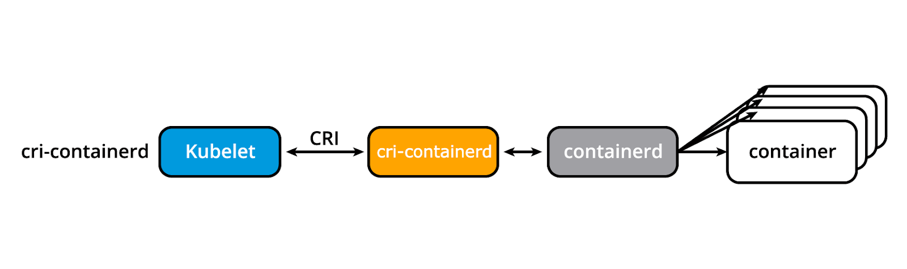

_Image 5 — kubelet ↔ CRI ↔ cri-containerd ↔ containerd ↔ containers_

Allows kubelet to manage containers directly through containerd.

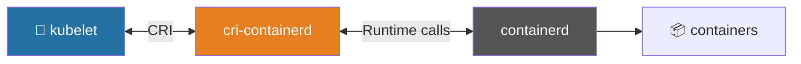
```mermaid
graph LR
    KB[🔧 kubelet] <-->|CRI| SHIM[cri-containerd] <-->|Runtime calls| CTD[containerd] --> C[📦 containers]
    style KB fill:#2471a3,color:#fff
    style SHIM fill:#e67e22,color:#fff
    style CTD fill:#555,color:#fff
```

**CRI-O**

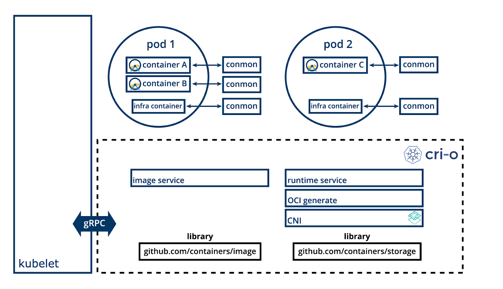

_Image 6 — kubelet ↔ gRPC ↔ CRI-O (image service + runtime service + CNI + OCI) ↔ containers in pods_

Enables any OCI-compatible runtime (like runC) to work with Kubernetes. Manages pods with a `conmon` monitor process per container for health tracking.

**dockershim → cri-dockerd**

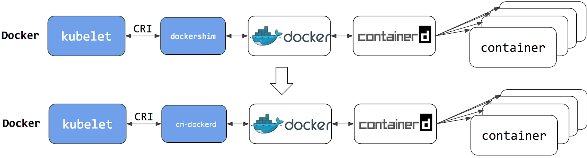

_Image 7 — Shows the evolution: old path used `dockershim` (now removed from Kubernetes v1.24+), replaced by `cri-dockerd` maintained by Docker/Mirantis_

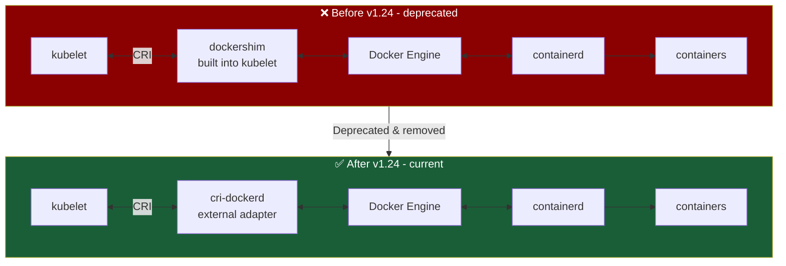
```mermaid
graph TD
    subgraph OLD[❌ Before v1.24 - deprecated]
        KB1[kubelet] <-->|CRI| DS[dockershim\nbuilt into kubelet] <--> DK1[Docker Engine] <--> CTD1[containerd] --> C1[containers]
    end

    subgraph NEW[✅ After v1.24 - current]
        KB2[kubelet] <-->|CRI| CDD[cri-dockerd\nexternal adapter] <--> DK2[Docker Engine] <--> CTD2[containerd] --> C2[containers]
    end

    OLD -->|Deprecated & removed| NEW

    style OLD fill:#8B0000,color:#fff
    style NEW fill:#1a5e38,color:#fff
```

### 4. kube-proxy — The Network Agent

**kube-proxy** runs on every node and is responsible for all networking rules on that node. It ensures that traffic gets correctly routed to the right containers, regardless of which node they're running on.

It works hand-in-hand with **iptables** (Linux's built-in firewall) to manage forwarding rules — created automatically based on **Kubernetes Service objects**.

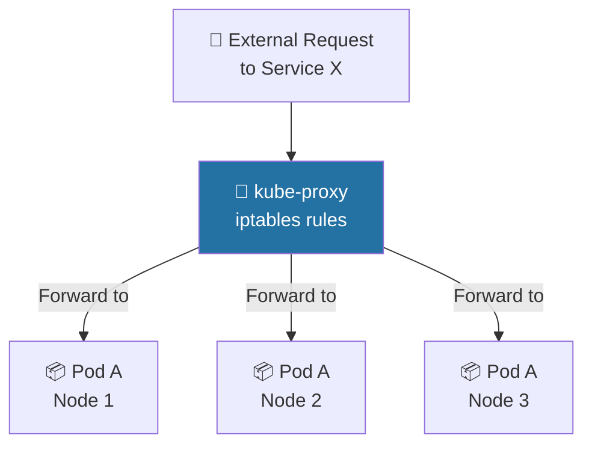
```mermaid
graph TD
    USER[👥 External Request\nto Service X]
    --> KP[🔀 kube-proxy\niptables rules]

    KP -->|Forward to| P1[📦 Pod A\nNode 1]
    KP -->|Forward to| P2[📦 Pod A\nNode 2]
    KP -->|Forward to| P3[📦 Pod A\nNode 3]

    style KP fill:#2471a3,color:#fff
```

Supports **TCP**, **UDP**, and **SCTP** forwarding, with both directed and random load balancing across pod backends.

### 5. Add-ons — Optional but Important

Add-ons extend Kubernetes with features that aren't built in:

| Add-on             | What It Does                                                                       |
| ------------------ | ---------------------------------------------------------------------------------- |
| **DNS**            | Assigns DNS names to Kubernetes objects so services can find each other by name    |
| **Dashboard**      | Web UI for managing and visualising the cluster                                    |
| **Monitoring**     | Collects container metrics and stores them centrally (e.g. Prometheus)             |
| **Logging**        | Collects container logs and stores them for analysis (e.g. Fluentd)                |
| **Device Plugins** | Lets nodes advertise special hardware (GPUs, FPGAs, high-performance NICs) to pods |

## Networking Challenges

Breaking a monolith into microservices means those services now have to **talk to each other over a network** instead of through internal function calls. Kubernetes must solve four distinct networking challenges:

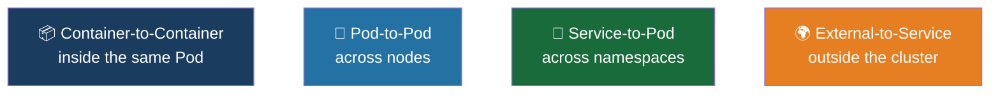
```mermaid
graph TD
    N1[📦 Container-to-Container\ninside the same Pod]
    N2[🔗 Pod-to-Pod\nacross nodes]
    N3[🔀 Service-to-Pod\nacross namespaces]
    N4[🌍 External-to-Service\noutside the cluster]

    style N1 fill:#1a3c5e,color:#fff
    style N2 fill:#2471a3,color:#fff
    style N3 fill:#1a6b3c,color:#fff
    style N4 fill:#e67e22,color:#fff
```

### Challenge 1: Container-to-Container (Inside a Pod)

When multiple containers are grouped in a Pod, they need to communicate. Kubernetes solves this elegantly — every Pod gets its own **network namespace**, created by a special hidden **Pause container** that exists solely for this purpose.

All containers in the Pod share this network namespace and can talk to each other using `localhost` — just like processes on the same machine.

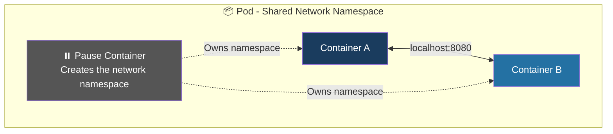
```mermaid
graph TD
    subgraph POD[📦 Pod - Shared Network Namespace]
        PAUSE[⏸️ Pause Container\nCreates the network namespace]
        CA[Container A]
        CB[Container B]

        CA <-->|localhost:8080| CB
        PAUSE -.->|Owns namespace| CA
        PAUSE -.->|Owns namespace| CB
    end

    style PAUSE fill:#555,color:#fff
    style CA fill:#1a3c5e,color:#fff
    style CB fill:#2471a3,color:#fff
```

### Challenge 2: Pod-to-Pod (Across Nodes)

Pods can be scheduled on any node — often unpredictably. Yet every Pod must be able to reach every other Pod **without NAT (Network Address Translation)**. Kubernetes achieves this through the **IP-per-Pod model** — every Pod gets its own unique IP address, just like a VM on a network.

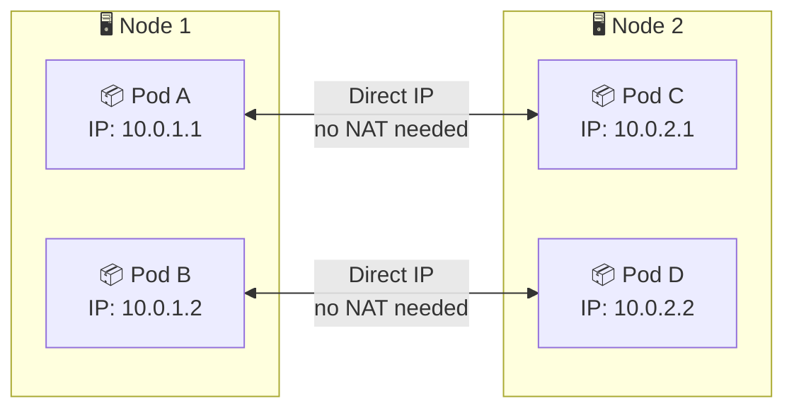
```mermaid
graph LR
    subgraph NODE1[🖥️ Node 1]
        P1[📦 Pod A\nIP: 10.0.1.1]
        P2[📦 Pod B\nIP: 10.0.1.2]
    end

    subgraph NODE2[🖥️ Node 2]
        P3[📦 Pod C\nIP: 10.0.2.1]
        P4[📦 Pod D\nIP: 10.0.2.2]
    end

    P1 <-->|Direct IP\nno NAT needed| P3
    P2 <-->|Direct IP\nno NAT needed| P4
```

**The Container Network Interface (CNI)**

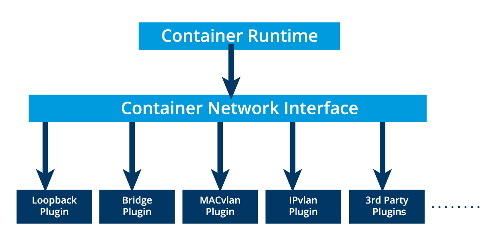

Containers get their IPs through the **CNI (Container Network Interface)** — a standard plugin system for configuring container networking.

_Image 8 shows the CNI model: the Container Runtime calls down to the CNI layer, which then delegates to a specific plugin (Bridge, MACvlan, IPvlan, or a 3rd-party SDN like Flannel, Calico, or Cilium)_.

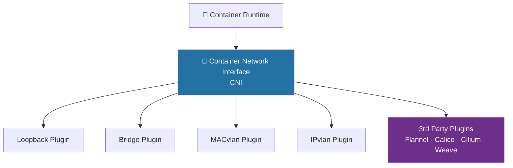
```mermaid
graph TD
    RT[🐳 Container Runtime]
    --> CNI[🔌 Container Network Interface\nCNI]

    CNI --> LP[Loopback Plugin]
    CNI --> BP[Bridge Plugin]
    CNI --> MP[MACvlan Plugin]
    CNI --> IP[IPvlan Plugin]
    CNI --> TP[3rd Party Plugins\nFlannel · Calico · Cilium · Weave]

    style CNI fill:#2471a3,color:#fff
    style TP fill:#6e2f8b,color:#fff
```

_The runtime asks CNI for an IP. CNI delegates to the configured plugin. The plugin assigns the IP and returns it to the runtime. Simple, pluggable, and flexible_.

### Challenge 3 & 4: Service-to-Pod and External Access

Once pods are running and talking to each other, you need a stable way to:

- Route traffic **between services** (even when pods are replaced and get new IPs)
- Expose applications to **external users** outside the cluster

Kubernetes solves both with **Services** — virtual IP addresses that act as a stable front door to a set of pods, managed by kube-proxy.

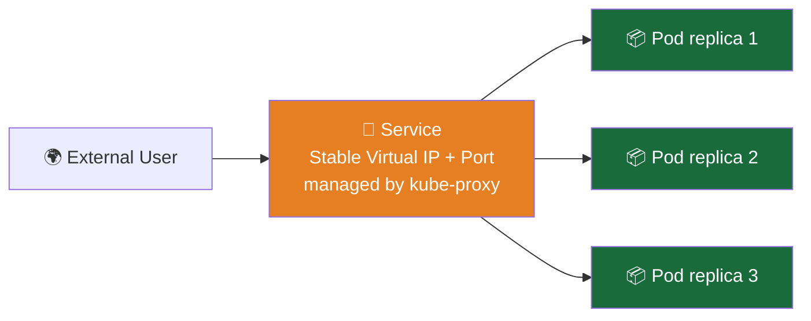
```mermaid
graph LR
    EXT[🌍 External User]
    --> SVC[🔀 Service\nStable Virtual IP + Port\nmanaged by kube-proxy]

    SVC --> P1[📦 Pod replica 1]
    SVC --> P2[📦 Pod replica 2]
    SVC --> P3[📦 Pod replica 3]

    style SVC fill:#e67e22,color:#fff
    style P1 fill:#1a6b3c,color:#fff
    style P2 fill:#1a6b3c,color:#fff
    style P3 fill:#1a6b3c,color:#fff
```

_Even if pods are replaced and their IPs change, the Service IP stays constant — so clients always know where to send traffic_.

## The Full Architecture at a Glance

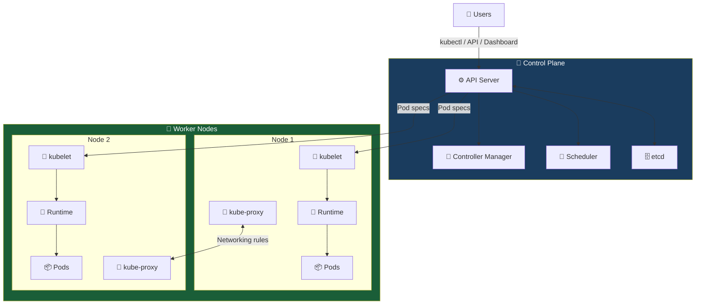
```mermaid
graph TD
    USER[👥 Users]

    subgraph CP[🧠 Control Plane]
        API[⚙️ API Server]
        SCHED[📅 Scheduler]
        CM[🔄 Controller Manager]
        ETCD[🗄️ etcd]
        API <--> ETCD
        API --> SCHED
        API --> CM
    end

    subgraph WN[💪 Worker Nodes]
        subgraph N1[Node 1]
            KB1[🔧 kubelet]
            KP1[🔀 kube-proxy]
            RT1[🐳 Runtime]
            POD1[📦 Pods]
            KB1 --> RT1 --> POD1
        end
        subgraph N2[Node 2]
            KB2[🔧 kubelet]
            KP2[🔀 kube-proxy]
            RT2[🐳 Runtime]
            POD2[📦 Pods]
            KB2 --> RT2 --> POD2
        end
    end

    USER -->|kubectl / API / Dashboard| API
    API -->|Pod specs| KB1
    API -->|Pod specs| KB2
    KP1 <-->|Networking rules| KP2

    style CP fill:#1a3c5e,color:#fff
    style WN fill:#1a5e38,color:#fff
```

**Key Takeaway**: Kubernetes architecture is cleanly divided — the **Control Plane thinks**, and the **Worker Nodes act**. The API Server is the central hub everything flows through. etcd is the cluster's memory. kubelet is the node's local enforcer. kube-proxy keeps the network working. Together, these components form a self-healing, self-managing system that can run thousands of containers across hundreds of nodes — reliably.
