# Kubernetes Configuration — Choosing How to Set Up Your Cluster

### Not One Size Fits All

Just like you wouldn't use a Formula 1 race car to do your grocery shopping, you wouldn't set up a full production-grade Kubernetes cluster just to learn the basics. Kubernetes offers several configuration types — from a single laptop setup all the way to a fully redundant, multi-region production cluster.

The key variables are:

- How many **control plane nodes** do you need?
- How many **worker nodes** do you need?
- Is **etcd stacked** (on the control plane) or **etcd external** (on its own hosts)?

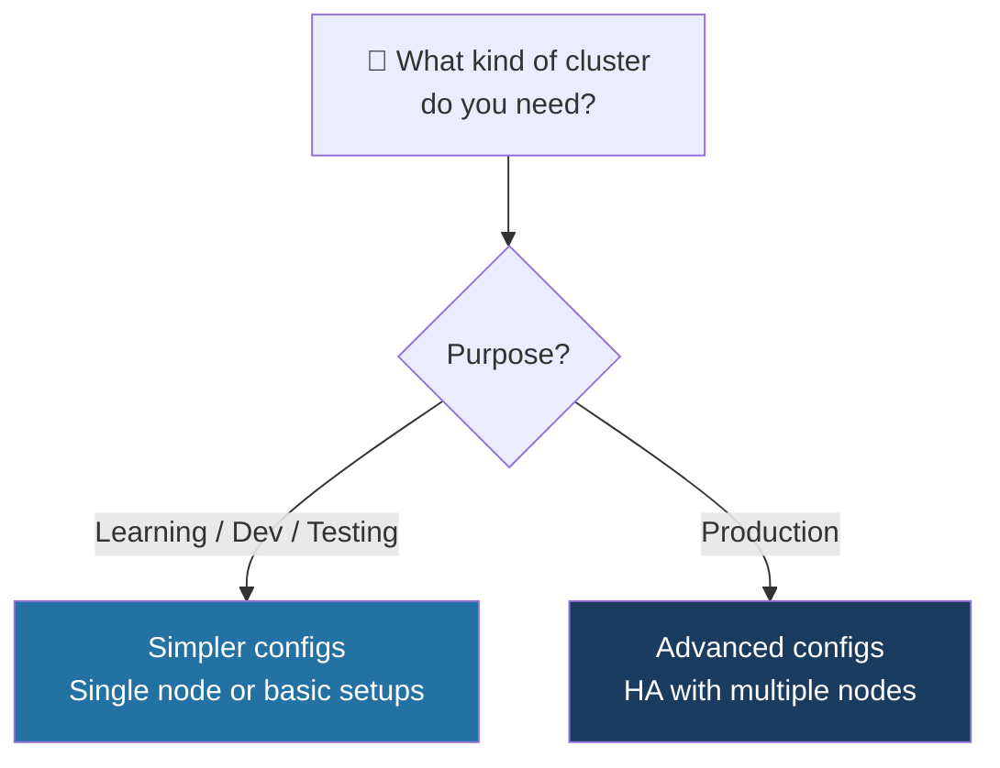

## The 5 Configuration Types

### 1. All-in-One Single-Node

**Everything** — control plane AND worker components — runs on a **single machine**. Think of it as a **studio apartment** — kitchen, bedroom, and living room all in one space. Convenient for one person, not liveable for a family.

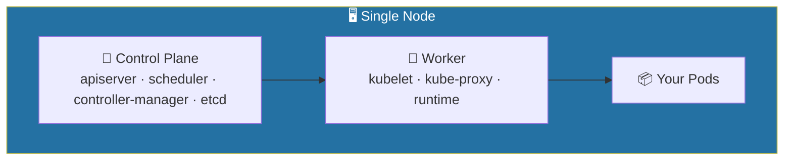

- **Great for**: learning, local dev, testing
- **Not for**: production

### 2. Single Control Plane + Multi-Worker (Stacked etcd)

One control plane node (with etcd running on it), managing multiple worker nodes. Like a manager with a team — **one brain, multiple hands**.

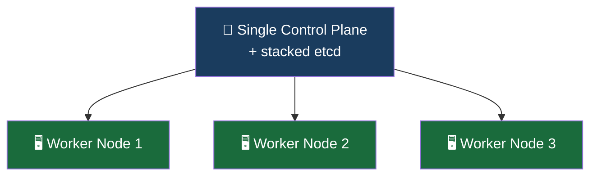

- Better than single-node — workloads are distributed.
- Control plane is still a single point of failure.

### 3. Single Control Plane + External etcd + Multi-Worker

Same as above, but etcd is moved off the control plane onto its own dedicated host. This protects the data store from being affected if the control plane has issues.

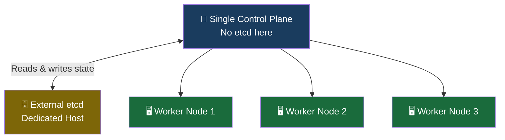

- etcd is protected from control plane failures.
- Control plane itself is still a single point of failure.

### 4. Multi-Control Plane + Stacked etcd + Multi-Worker (HA)

Now we're talking proper production. Multiple control plane nodes — each with its own stacked etcd instance — forming a HA cluster. If one control plane node fails, the others keep the cluster running.

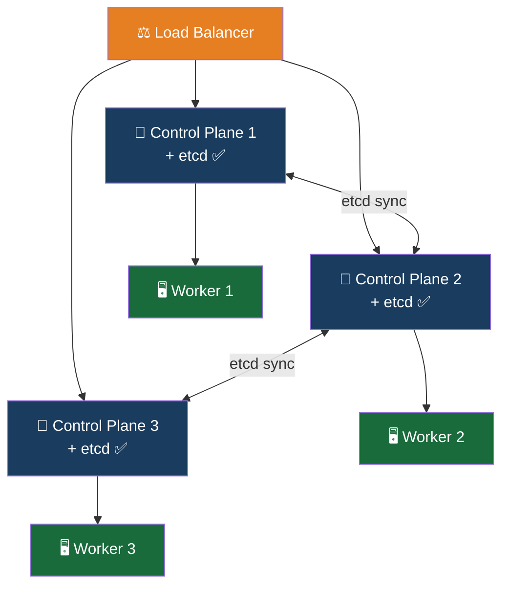

- Control plane is fault-tolerant
- etcd is replicated across control plane nodes
- etcd and control plane still share the same nodes — a node failure affects both

### 5. Multi-Control Plane + External etcd + Multi-Worker (Full HA)

The gold standard for production. Control plane and etcd are fully decoupled and both run in HA mode on their own dedicated hosts. This is the most resilient, most complex, and most expensive configuration.

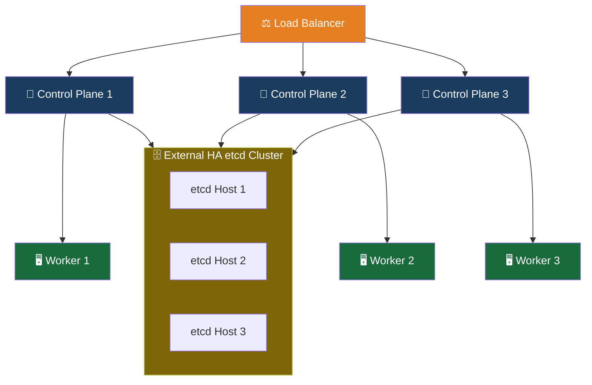

- Maximum resilience — control plane and etcd failures are independent
- Recommended for production at scale
- Highest hardware cost and operational complexity

## All 5 Configurations — Side by Side

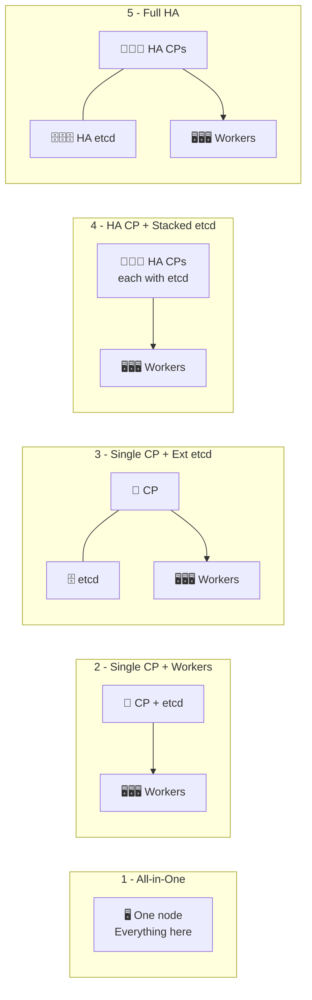

| Config | Control Plane       | etcd        | Workers   | Use Case            |
| ------ | ------------------- | ----------- | --------- | ------------------- |
| 1      | Single (all-in-one) | Stacked     | Same node | Learning only       |
| 2      | Single              | Stacked     | Multiple  | Dev / Small teams   |
| 3      | Single              | External    | Multiple  | Better dev setup    |
| 4      | HA (multiple)       | Stacked     | Multiple  | Production          |
| 5      | HA (multiple)       | External HA | Multiple  | Production at scale |

## Infrastructure Decisions

Before installing, you need to answer three key questions:

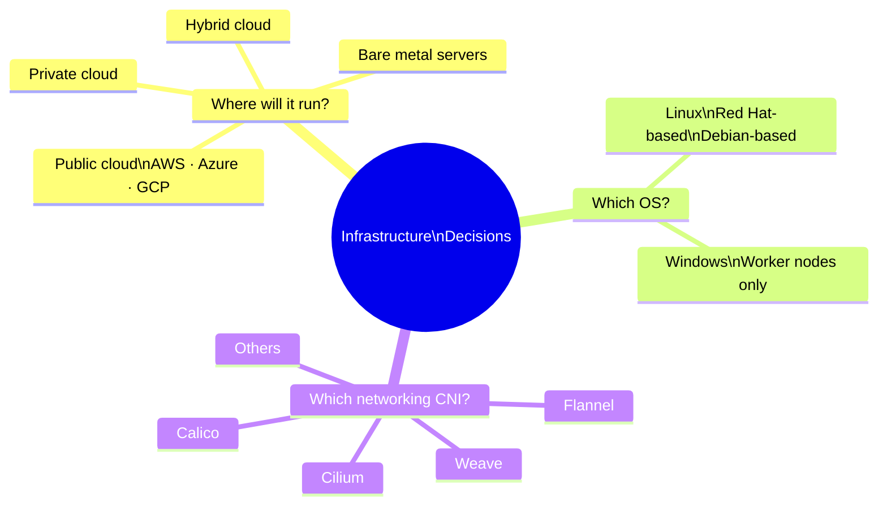

These choices affect performance, cost, compatibility, and how you manage the cluster long-term. The environment you're targeting — learning vs production — is usually the clearest guide.

## Local Learning Clusters — Getting Started Fast

For learning and development, you don't need a full cluster. These tools let you spin up a Kubernetes environment on your own laptop or workstation in minutes:

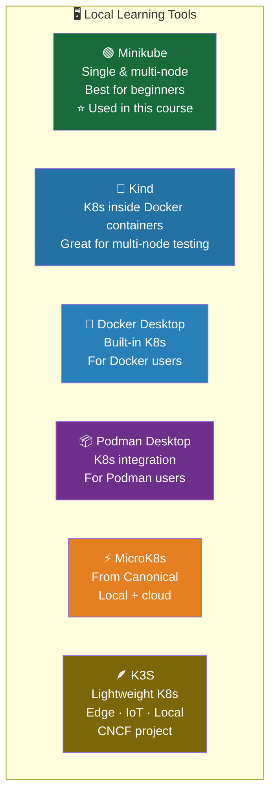

_**This course uses Minikube** — it's the most beginner-friendly, highly flexible, and built with features specifically designed to simplify your interaction with Kubernetes during learning_.

| Tool               | Best For                        | Nodes                |
| ------------------ | ------------------------------- | -------------------- |
| **Minikube**       | Beginners, this course          | Single & multi       |
| **Kind**           | Multi-node testing in CI        | Multi (Docker-based) |
| **Docker Desktop** | Docker users wanting quick K8s  | Single               |
| **Podman Desktop** | Podman users                    | Single               |
| **MicroK8s**       | Lightweight local + small cloud | Single & multi       |
| **K3S**            | Edge, IoT, resource-constrained | Single & multi       |

## Production Cluster Deployment Tools

When you're ready for a real production environment, these tools handle the heavy lifting of bootstrapping a full cluster:

### Kubeadm

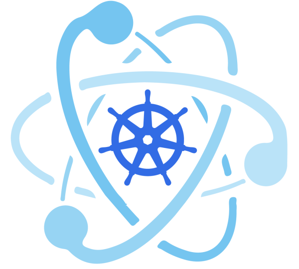

**kubeadm** is a first-class citizen of the Kubernetes ecosystem. It is a secure and recommended method to bootstrap a multi-node production ready Highly Available Kubernetes cluster, on-premises or in the cloud. kubeadm can also bootstrap a single-node cluster for learning. It has a set of building blocks to set up the cluster, but it is easily extendable to add more features. Please note that kubeadm does not support the provisioning of hosts - they should be provisioned separately with a tool of our choice.

### Kubespray

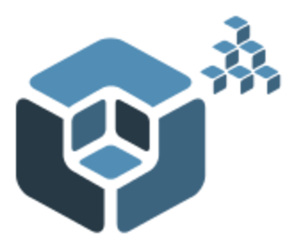

**kubespray** (formerly known as kargo) allows us to install Highly Available production ready Kubernetes clusters on AWS, GCP, Azure, OpenStack, vSphere, or bare metal. kubespray is based on Ansible, and is available on most Linux distributions.

### Kops

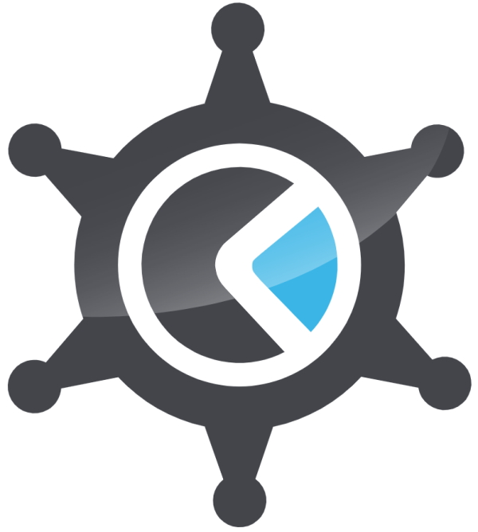

**kops** enables us to create, upgrade, and maintain production-grade, Highly Available Kubernetes clusters from the command line. It can provision the required infrastructure as well. Currently, AWS and GCE are officially supported. Support for DigitalOcean and OpenStack is in beta, while Azure is in alpha support, and other platforms are planned for the future.

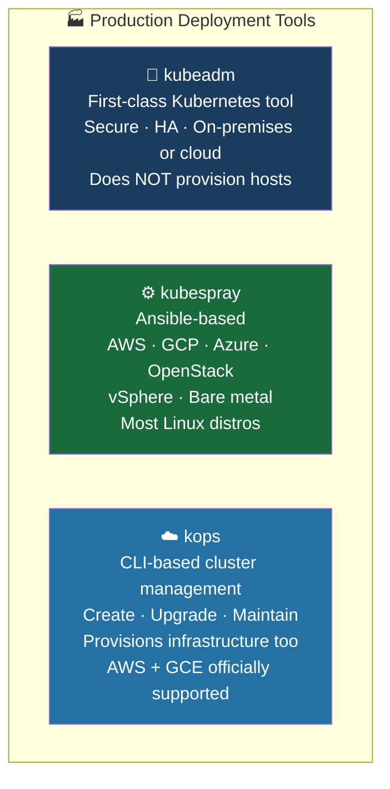

| Tool          | Provisions Hosts?                      | Platforms                                             | Best For                                   |
| ------------- | -------------------------------------- | ----------------------------------------------------- | ------------------------------------------ |
| **kubeadm**   | ❌ No — you handle hosts               | On-prem, any cloud                                    | Standard HA cluster setup                  |
| **kubespray** | ❌ No — uses Ansible on existing hosts | AWS, GCP, Azure, OpenStack, vSphere, bare metal       | Ansible-based teams, wide platform support |
| **kops**      | ✅ Yes — provisions infra too          | AWS (full), GCE (full), DigitalOcean/OpenStack (beta) | Full lifecycle management from CLI         |

## Kubernetes on Windows

Windows plays a major role in enterprise environments, and Kubernetes has progressively added Windows support over the years. Here's what you need to know:

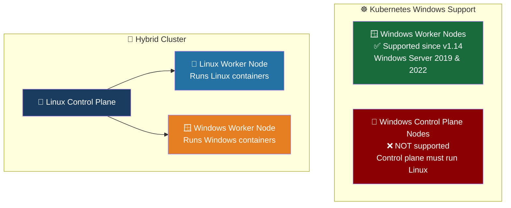

Key points to remember:

| Aspect                     | Detail                                                     |
| -------------------------- | ---------------------------------------------------------- |
| Windows worker nodes       | ✅ Supported since Kubernetes v1.14                        |
| Windows control plane      | ❌ Not supported — must use Linux                          |
| Supported Windows versions | Windows Server 2019 and Windows Server 2022                |
| Cluster type               | Can be Windows-only or hybrid (Linux + Windows nodes)      |
| Workload scheduling        | You must configure workloads to target the correct OS node |

When running a hybrid cluster, you are responsible for making sure Linux containers are scheduled on Linux nodes and Windows containers are scheduled on Windows nodes. Kubernetes won't do this automatically — you configure it through node selectors or affinity rules.

## The Full Installation Decision Tree

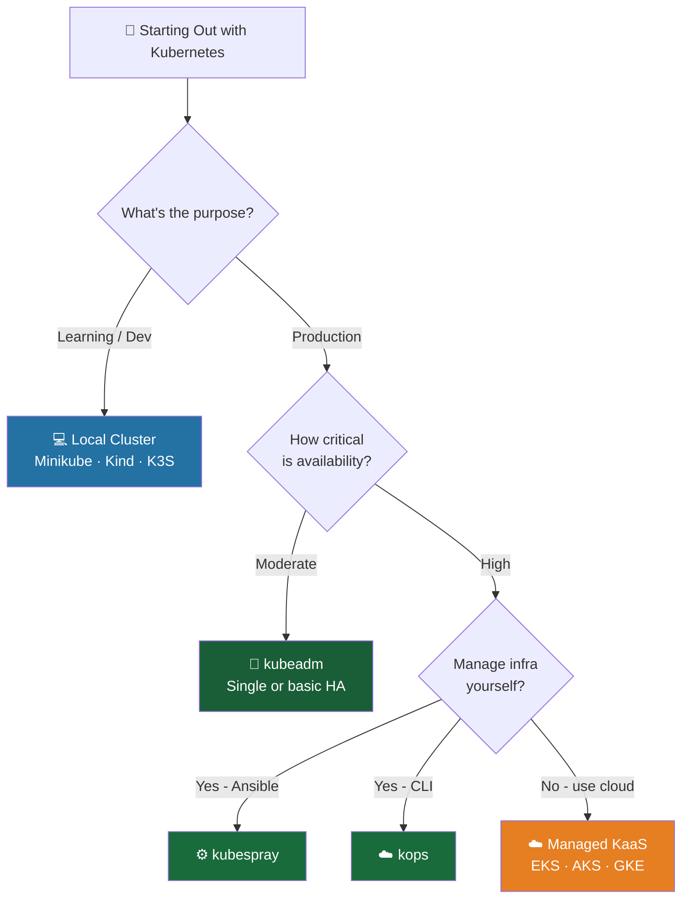

**Key Takeaway**: Kubernetes configuration is not one-size-fits-all. Start with **Minikube** to learn, graduate to **kubeadm** or **kubespray** for production, and aim for a **multi-control-plane with external etcd** setup when reliability truly matters. Always match your cluster design to your actual needs — over-engineering early is as costly as under-engineering later.
