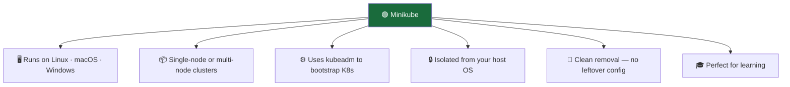
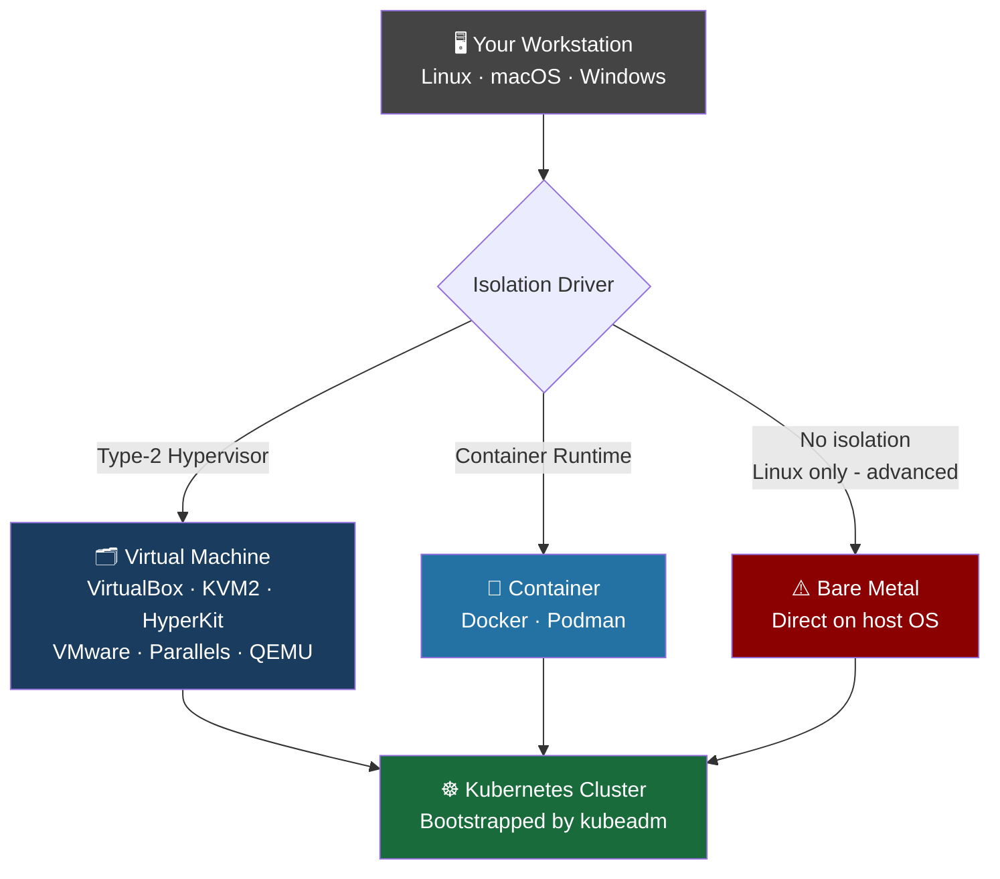
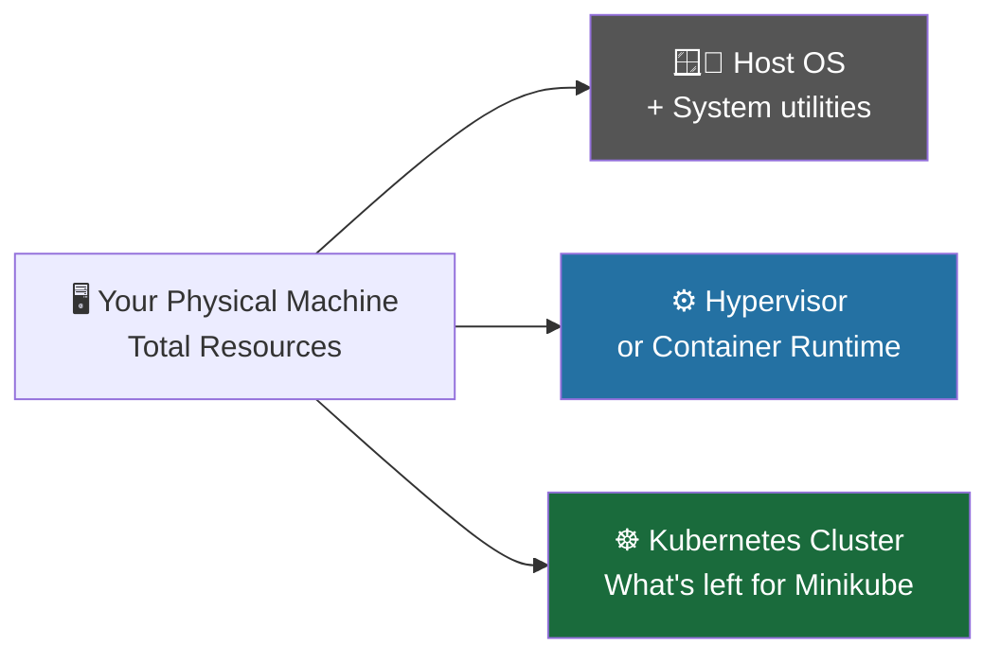
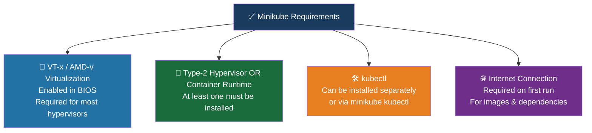
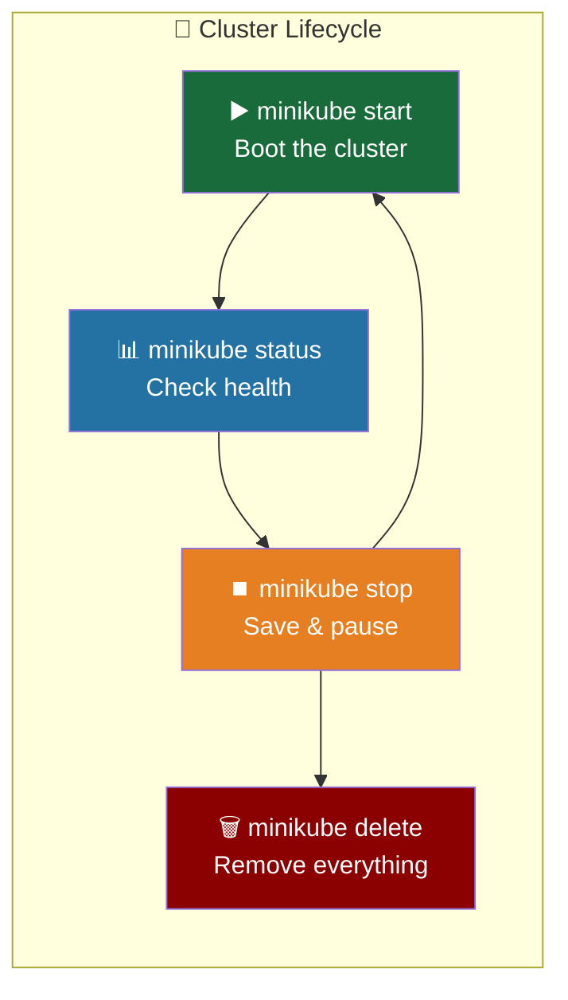
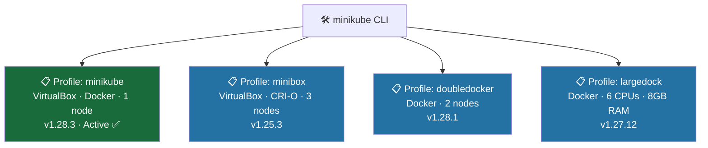
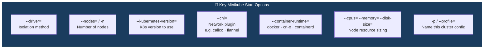
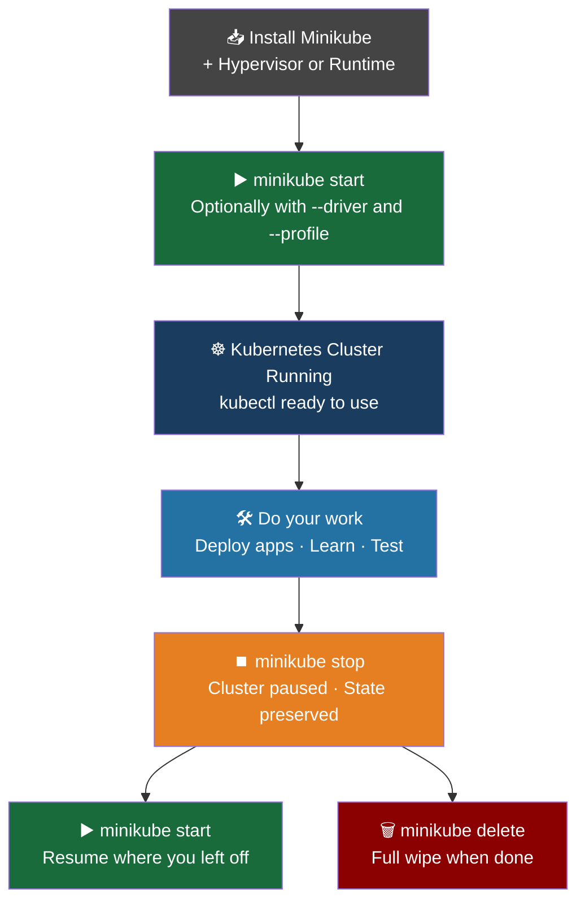

# Installing a Local Kubernetes Cluster with Minikube

### What is Minikube?

Minikube is the **easiest and most popular way to run Kubernetes on your own laptop or workstation**. It sets up a fully functional Kubernetes cluster — single-node or multi-node — isolated from your host machine so you can learn, experiment, and tear it all down when you're done, leaving zero traces behind.

Think of Minikube like a **portable practice kitchen**. It gives you all the professional equipment of a real restaurant kitchen, but set up safely in your garage. You can cook anything, make a mess, and pack it all away when you're done — without touching your actual home kitchen.



### How Minikube Works Under the Hood

Minikube doesn't run Kubernetes directly on your machine. Instead, it **provisions an isolated environment** — either a Virtual Machine or a Container — and runs the Kubernetes cluster inside it. This isolation is what keeps your workstation clean.



_Minikube is built on the **libmachine** library — originally created by Docker to provision Virtual Machine container hosts on any infrastructure. Over time it evolved to support many drivers and runtimes_.

### Resource Planning

Your Minikube cluster is ultimately limited by your physical machine. Before starting, make sure you've accounted for what your host OS needs, what the hypervisor/runtime needs, and what's left for Kubernetes.



### Minimum recommended specs per Kubernetes node:

| Resource | Minimum         | Recommended           |
| -------- | --------------- | --------------------- |
| CPU      | 2 cores / vCPUs | 4+ cores              |
| RAM      | 2 GB            | 4–8 GB                |
| Disk     | 20 GB           | 20+ GB                |
| Network  | Internet access | Required on first run |

### Requirements Checklist

Before installing Minikube, make sure you have:



### Supported Drivers by OS

| OS          | Hypervisors                                          | Container Runtimes |
| ----------- | ---------------------------------------------------- | ------------------ |
| **Linux**   | VirtualBox, KVM2, QEMU                               | Docker, Podman     |
| **macOS**   | VirtualBox, HyperKit, VMware Fusion, Parallels, QEMU | Docker, Podman     |
| **Windows** | VirtualBox, Hyper-V, VMware Workstation, QEMU        | Docker, Podman     |

_If multiple drivers are found, Minikube picks the best one automatically. On Linux, the preference order is: **docker → kvm2 → podman → vmware → virtualbox**. You can always override this with `--driver=<name>`_.

## Installing Minikube on Linux (Ubuntu 22.04 + VirtualBox)

### Step 1 — Verify Virtualization Support

```bash
$ grep -E --color 'vmx|svm' /proc/cpuinfo
```

_A non-empty output means virtualization is supported. No output = check your BIOS settings_.

### Step 2 — Install VirtualBox

Download VirtualBox from the official site. It supports Oracle Linux, RHEL, CentOS, Ubuntu, Debian, openSUSE, Fedora and more.

### Step 3 — Download & Install Minikube

```bash
$ curl -LO \
  https://github.com/kubernetes/minikube/releases/latest/download/minikube-linux-amd64

$ sudo install minikube-linux-amd64 /usr/local/bin/minikube && rm minikube-linux-amd64
```

_Replace `/latest/` with a specific version like `/v1.31.2/` to install that exact release_.

### Step 4 — Start Minikube

```bash
$ minikube start --driver=virtualbox
```

Minikube will download the VM image, provision the VM, and bootstrap the Kubernetes cluster automatically using kubeadm:

```
😄  minikube v1.32.0 on Ubuntu 22.04
✨  Using the virtualbox driver based on user configuration
🔥  Creating virtualbox VM (CPUs=2, Memory=6000MB, Disk=20000MB) ...
🐳  Preparing Kubernetes v1.28.3 on Docker 24.0.7 ...
🔗  Configuring bridge CNI ...
🏄  Done! kubectl is now configured to use "minikube" cluster
```

### Common Commands — Linux & Windows



### Check Status

```bash
$ minikube status

minikube
type: Control Plane
host: Running
kubelet: Running
apiserver: Running
kubeconfig: Configured
```

### Stop (Preserves Your Work)

```bash
$ minikube stop

✋  Stopping node "minikube"  ...
🛑  1 node stopped.
```

_Your cluster state is saved. Just run `minikube start` again later — no `--driver` flag needed_.

### Delete (Wipes Everything)

```bash
$ minikube delete

🔥  Deleting "minikube" in virtualbox ...
💀  Removed all traces of the "minikube" cluster.
```

_This is permanent. All work is lost_.

## Installing Minikube on Windows (Windows 10/11 + VirtualBox)

The process is nearly identical to Linux, with a few Windows-specific steps:

1. **Check virtualization** — run `systeminfo` in PowerShell and look for lines ending with `Yes`.
2. **Install VirtualBox** — download the `.exe` from the official site.
   - If Hyper-V is installed, you may need to disable it first
3. **Install Minikube** — download and run `minikube-installer.exe` from the Minikube release page (it automatically adds minikube to your PATH)
4. **Start Minikube** — always run PowerShell as Administrator:

```powershell
PS C:\WINDOWS\system32> minikube start --driver=virtualbox
```

All other commands (`status`, `stop`, `delete`) work exactly the same as Linux, just run them in **PowerShell as Administrator**.

## Advanced Minikube Features — Profiles

### What is a Profile?

Every time you run `minikube start`, it creates a **profile** — a saved specification of your cluster (driver, runtime, K8s version, node count, resources, etc.). By default this profile is named `minikube`.

Profiles let you create and manage **multiple independent clusters** from a single command line tool — each with different configurations.



### Listing Profiles

```bash
$ minikube profile list

|----------|------------|---------|----------------|------|---------|---------|-------|--------|
| Profile  | VM Driver  | Runtime |       IP       | Port | Version | Status  | Nodes | Active |
|----------|------------|---------|----------------|------|---------|---------|-------|--------|
| minibox  | virtualbox | crio    | 192.168.59.101 | 8443 | v1.25.3 | Running |     3 |        |
| minikube | virtualbox | docker  | 192.168.59.100 | 8443 | v1.25.3 | Running |     1 | *      |
|----------|------------|---------|----------------|------|---------|---------|-------|--------|
```

The `*` under Active marks your current **context** — the cluster that minikube commands will target by default.

### Switching Between Profiles

```bash
# Switch to minibox cluster
$ minikube profile minibox

# Switch back to default
$ minikube profile minikube
# or
$ minikube profile default
```

## Creating Custom Clusters — Examples

Here's what powerful custom profile creation looks like. Each command creates a completely different, reusable cluster:

```bash
# Podman driver, specific K8s version
$ minikube start --kubernetes-version=v1.27.10 \
  --driver=podman --profile minipod

# 2-node Docker cluster
$ minikube start --nodes=2 --kubernetes-version=v1.28.1 \
  --driver=docker --profile doubledocker

# 3-node VirtualBox cluster with Calico CNI + CRI-O runtime
$ minikube start --driver=virtualbox --nodes=3 --disk-size=10g \
  --cpus=2 --memory=6g --kubernetes-version=v1.27.12 \
  --cni=calico --container-runtime=cri-o -p multivbox

# Large Docker cluster — 6 CPUs, 8GB RAM
$ minikube start --driver=docker --cpus=6 --memory=8g \
  --kubernetes-version="1.27.12" -p largedock

# 3-node VirtualBox cluster with containerd + Calico
$ minikube start --driver=virtualbox -n 3 \
  --container-runtime=containerd --cni=calico -p minibox
```



### Useful Day-to-Day Commands

**Check Version**

```bash
$ minikube version

minikube version: v1.32.0
commit: 8220a6eb95f0a4d75f7f2d7b14cef975f050512d
```

**Enable Tab Completion (Linux/bash)**

```bash
$ sudo apt install bash-completion
$ source /etc/bash_completion
$ source <(minikube completion bash)
```

**List Nodes in a Cluster**

```bash
# Default cluster
$ minikube node list
minikube    192.168.59.100

# Custom profile
$ minikube node list -p minibox
minibox         192.168.59.101
minibox-m02     192.168.59.102
minibox-m03     192.168.59.103
```

**Get Node IP Addresses**

```bash
$ minikube ip                          # Default cluster control plane IP
$ minikube -p minibox ip               # minibox control plane IP
$ minikube -p minibox ip -n minibox-m02  # Specific node IP
```

**Stop & Start Specific Clusters**

```bash
$ minikube stop -p minibox    # Stop minibox (explicit profile)
$ minikube start -p minibox   # Start minibox again

$ minikube stop               # Stop default cluster (implicit)
$ minikube start              # Start default cluster again
```

**Delete a Cluster**

```bash
# Delete default cluster
$ minikube delete
🔥  Deleting "minikube" in virtualbox ...
💀  Removed all traces of the "minikube" cluster.

# Delete a custom profile (all 3 nodes)
$ minikube delete -p minibox
🔥  Deleting "minibox" in virtualbox ...
🔥  Deleting "minibox-m02" in virtualbox ...
🔥  Deleting "minibox-m03" in virtualbox ...
💀  Removed all traces of the "minibox" cluster.
```

### The Full Minikube Workflow at a Glance



**Key Takeaway**: Minikube is your Kubernetes sandbox. It's fast to set up, safe to experiment with, and easy to wipe clean. Profiles make it even more powerful — letting you maintain multiple cluster configurations side by side with a single tool. Mastering Minikube locally is the best foundation for understanding how real production clusters behave.
