# Cloud Native Architecture Fundamentals

### What Does "Cloud Native" Actually Mean?

The term gets thrown around a lot, but at its core, cloud native is about **optimising your software for cost efficiency, reliability, and speed** — by combining the right technologies, the right architecture, and the right culture.

The CNCF defines it as building systems that are **loosely coupled, secure, resilient, manageable, sustainable, and observable** — running across public, private, or hybrid cloud environments, at scale, in a repeatable way.

Think of it like the difference between a **Swiss Army knife** and a **specialist toolkit**. A Swiss Army knife (monolith) does everything but nothing particularly well. A specialist toolkit (cloud native) has the perfect tool for every job — and you can swap, upgrade, or add individual tools without replacing the whole kit.

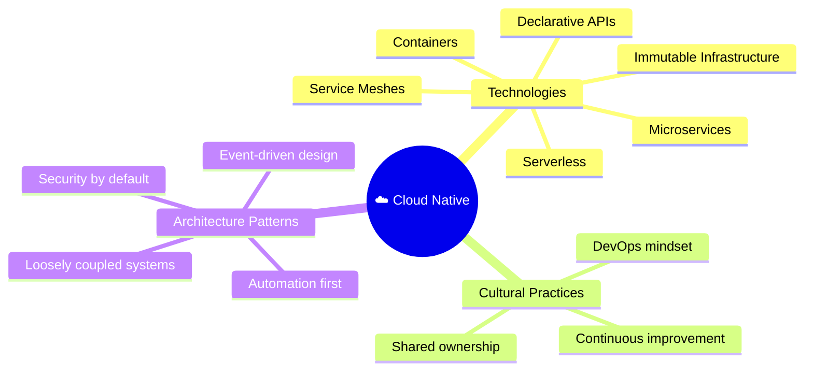

## Monolith vs Microservices — The Core Shift

Traditional applications are built as a **monolith** — one giant self-contained unit with everything bundled together: the UI, the business logic, the database layer. It all runs as one process on one server.

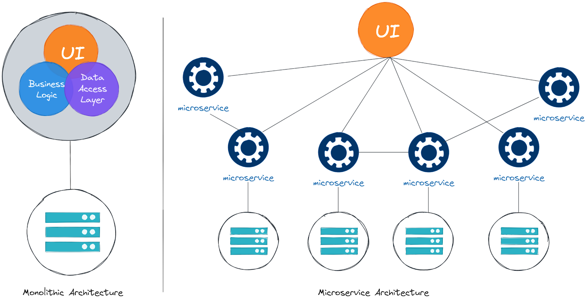

_Image shows this contrast clearly — on the left, a monolith bundles UI, Business Logic, and Data Access Layer into a single unit backed by one database. On the right, microservices architecture breaks these into many independent services, each with its own data store, all connected to the UI separately_.

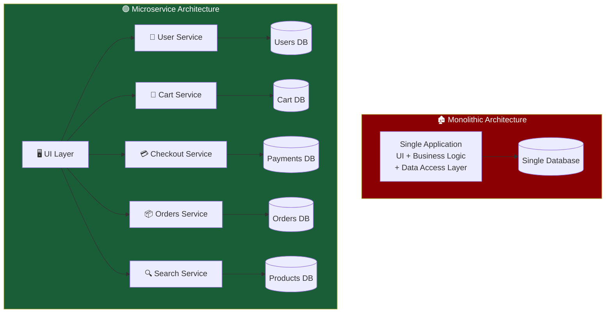

_The payoff is enormous: **different teams can own**, **deploy**, and **scale individual services independently** — without waiting on each other or risking breaking the whole application_.

## Characteristics of Cloud Native Architecture

### 1. High Level of Automation

Managing dozens of microservices manually would be chaos. Cloud native applications are designed around **automation at every step** — from writing code to deploying it to production.

This is achieved through **CI/CD pipelines** (Continuous Integration / Continuous Delivery) backed by version control (like Git):

_Benefits: fast releases, fewer human errors, and — critically — **easy disaster recovery**. If something breaks, your automated system can rebuild the entire environment from scratch_.

### 2. Self-Healing

Failures are expected. Cloud native systems don't just tolerate failures — **they recover from them automatically**.

Each component includes **health checks** that monitor it from the inside. If a service becomes unresponsive or crashes, the system detects it and restarts it — without a human having to wake up at 3am.

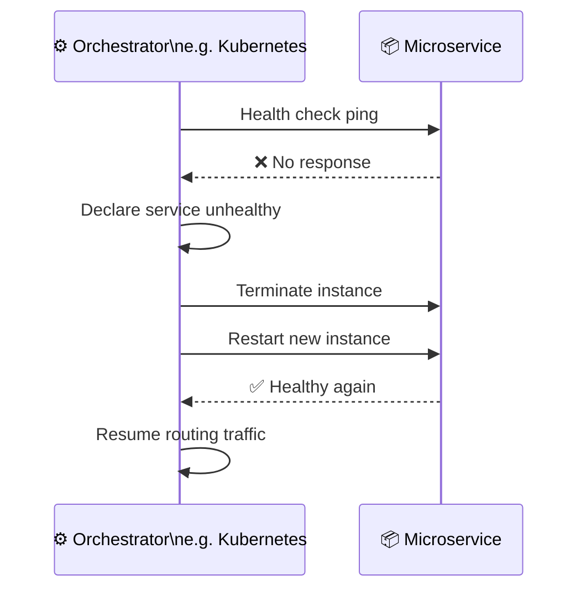

_Because the app is broken into microservices, a failure in one component doesn't necessarily bring everything else down — the rest keeps running while the broken piece heals_.

### 3. Scalable

Scaling means **handling more users without degrading their experience**. Cloud native apps are designed to scale gracefully — usually by spinning up more copies of a service and distributing the load.

This can be automated based on real-time metrics like CPU usage or memory pressure:

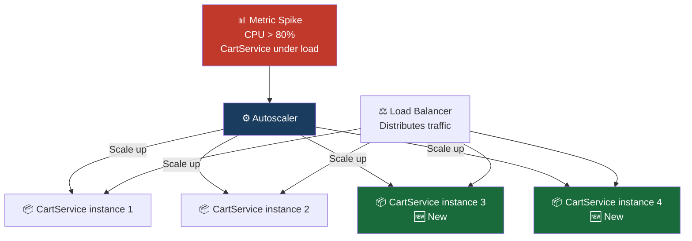

### 4. Cost-Efficient

Scaling isn't just about going up — it's equally about scaling down. Cloud native apps combined with usage-based cloud pricing mean you only pay for what you use.

Tools like Kubernetes help **pack workloads more densely** onto available hardware, squeezing more value out of every server.

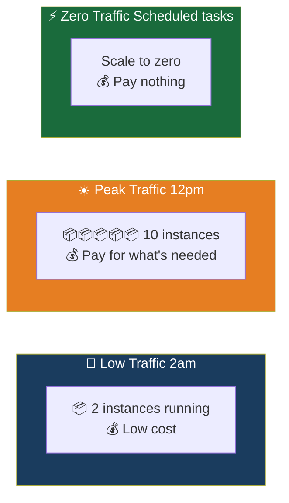

### 5. Easy to Maintain

Microservices make the codebase **smaller, more focused, and easier to reason about**. Each service does one thing well. Teams can own their slice of the system without needing to understand the whole thing.

Benefits include easier testing, simpler deployments, and the ability to **rewrite or replace individual services** without touching anything else.

### 6. Secure by Default

Cloud environments are shared — between teams, between customers, sometimes between companies. The old security model of "trust everything inside the firewall" doesn't work anymore.

Cloud native adopts **Zero Trust** — _nobody and nothing is trusted by default_, regardless of where they are on the network:

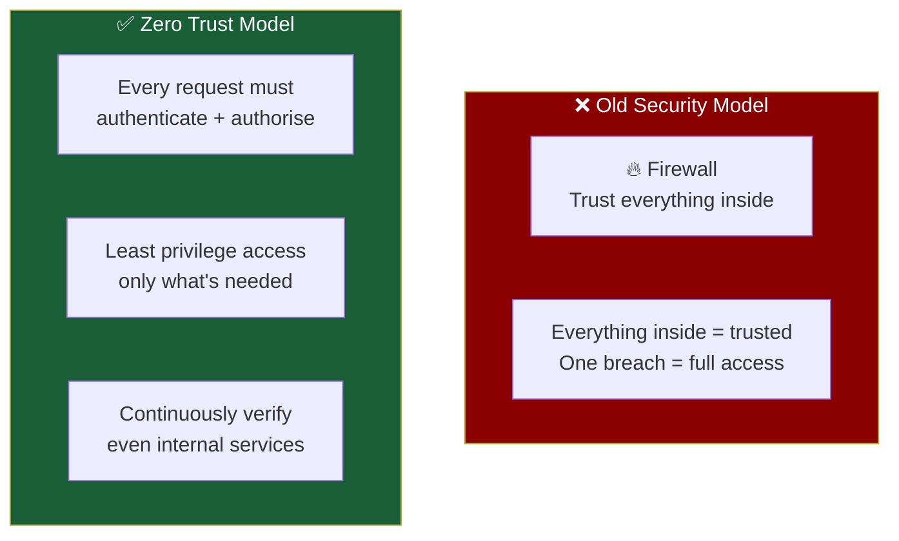

_A good starting point for cloud native security and best practices is The Twelve-Factor App — a set of guidelines covering version control, configuration management, statelessness, concurrency, and more_.

## Cloud Native Characteristics — Summary

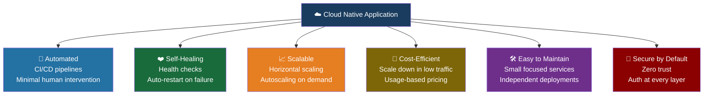

## Autoscaling — Scaling Up and Out

### Vertical vs Horizontal Scaling

When your application comes under load, you have two fundamental options for scaling it:

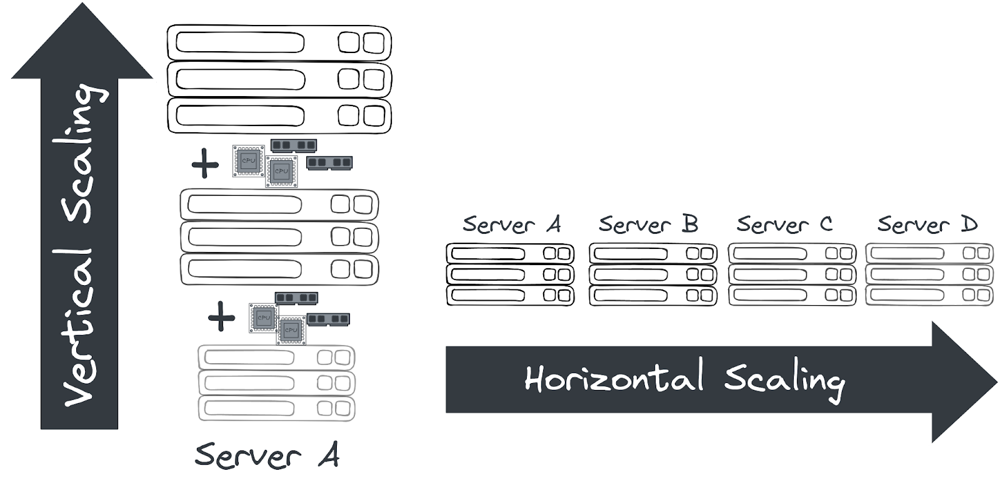

_Image above illustrates this clearly — vertical scaling adds more CPU and RAM to a single server (Server A grows taller), while horizontal scaling adds more servers side by side (Server A → B → C → D)_.

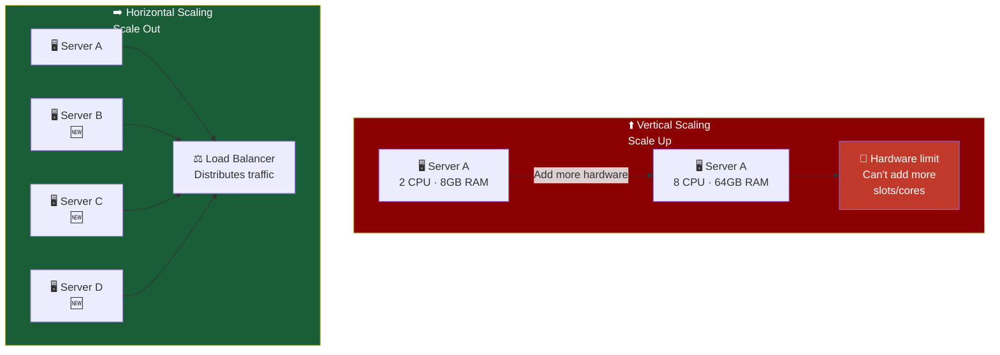

The **muscle analogy** makes it intuitive:

- **Vertical** = Build muscle to carry the weight yourself. But your body has a limit.
- **Horizontal** = Call friends to share the load. No real upper limit — just add more friends.

Cloud native architectures strongly favour horizontal scaling — it has **no theoretical upper limit** and aligns perfectly with container and microservice design.

**Autoscaling Configuration**

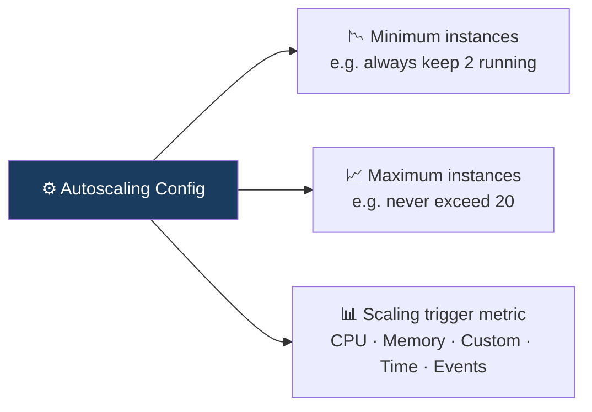

_Getting autoscaling right requires **load testing** — run near-production traffic simulations, observe behaviour, and tune your min/max and trigger thresholds accordingly_.

## Serverless — Code Without Infrastructure

### What is Serverless?

Despite the name, servers absolutely still exist in serverless. What changes is **who manages them** — instead of you, the cloud provider handles all the infrastructure: networks, virtual machines, OS, load balancers — all of it.

You just upload your code. The cloud figures out where and how to run it.

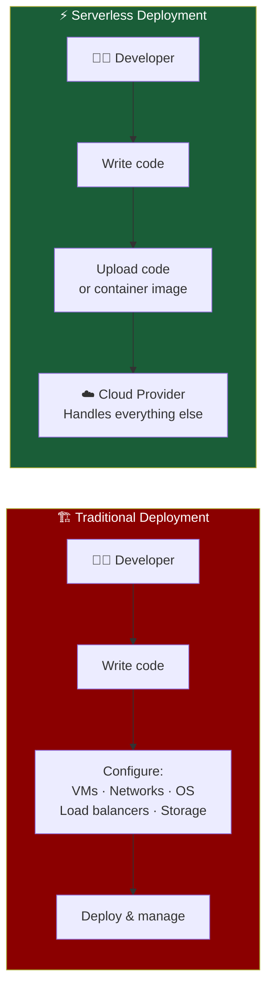

### Function as a Service (FaaS)

A popular subset of serverless is **FaaS** — where instead of deploying a whole app, you deploy individual **functions** that execute in response to events (an HTTP request, a file upload, a message in a queue).

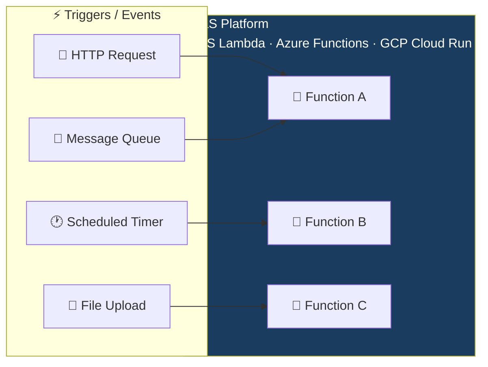

### Serverless Billing — Pay Per Event

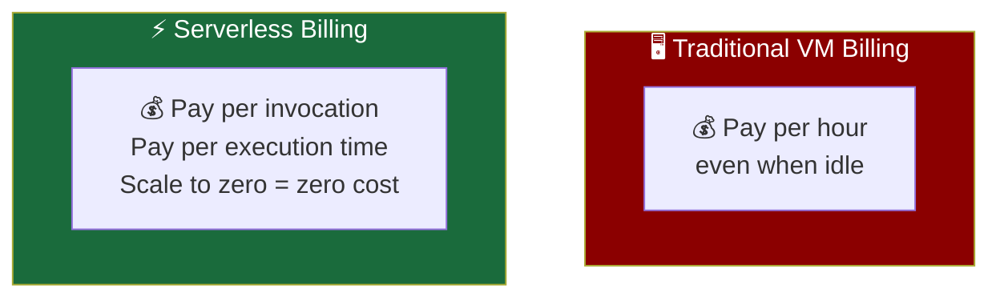

### The CloudEvents Standard

One of serverless's early struggles was **fragmentation** — every cloud provider had a different way to structure event data, making it hard to switch platforms or combine multiple clouds.

**CloudEvents** (now a CNCF Graduated project) solves this by providing a **common specification for event data** — so events look the same regardless of which platform generates or consumes them.

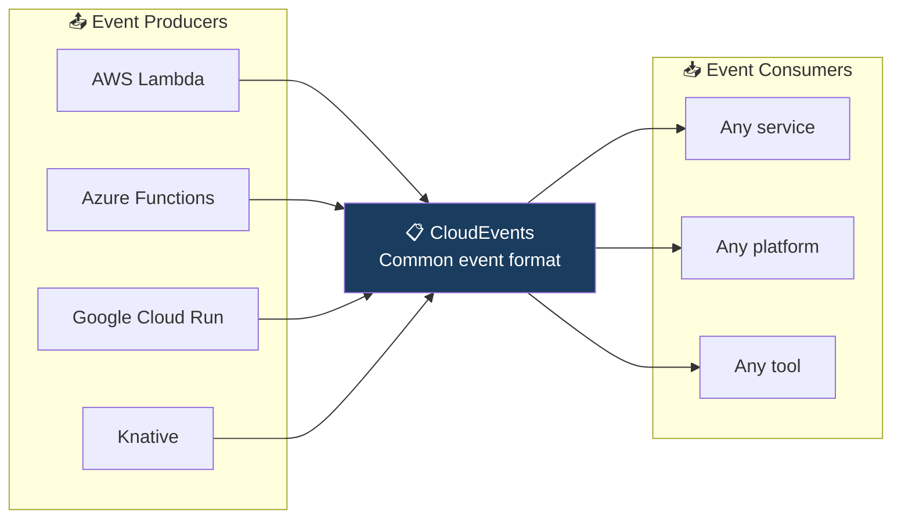

_**Knative** — built on top of Kubernetes — extends existing platforms with serverless capabilities, making it possible to bring serverless to private clouds and on-premises environments too_.

## Open Standards — The Glue That Holds It Together

Cloud native's success depends heavily on **open, vendor-neutral standards** that allow tools, runtimes, and platforms to interoperate. Without standards, every vendor would build incompatible silos.

The **Open Container Initiative (OCI)** under the Linux Foundation defines three key specs:

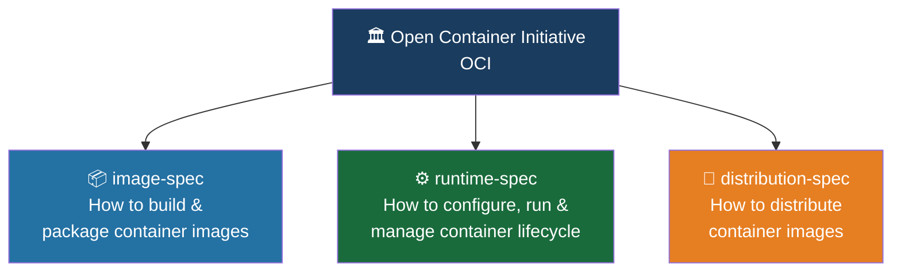

### The Full Stack of Cloud Native Standards

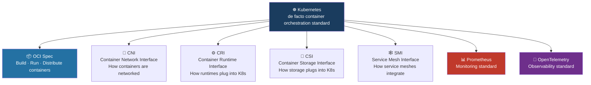

_Open standards prevent **vendor lock-in** — the ability for any provider to offer a conformant product means you can switch or combine platforms without rewriting everything_.

## Cloud Native Roles & Site Reliability Engineering

### How Job Roles Have Evolved

The cloud revolution didn't just change technology — it changed **how people work and what skills are valued**. Old roles like "system administrator" and "database administrator" have evolved into more fluid, cross-functional positions.

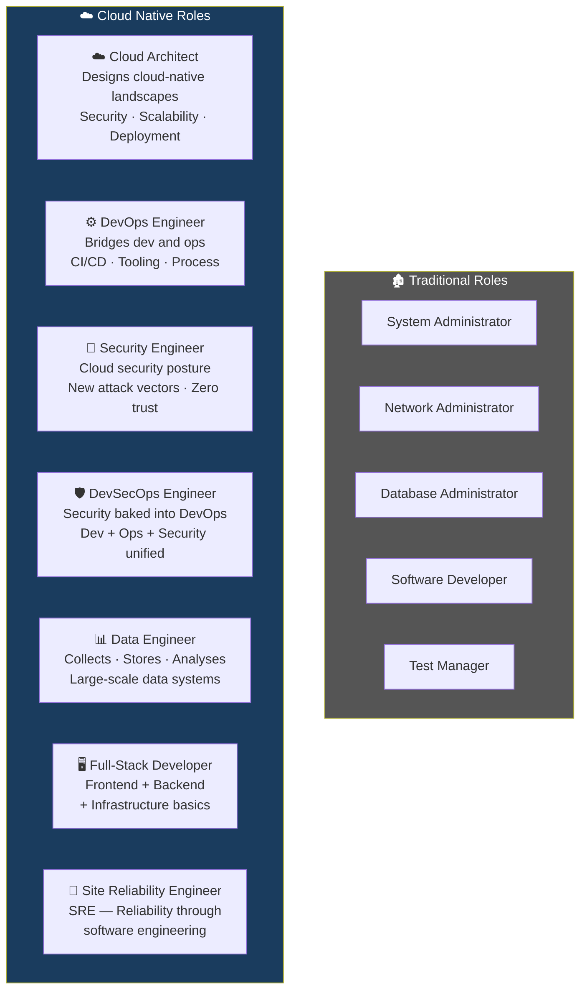

### Site Reliability Engineering (SRE) — A Closer Look

SRE is one of the most precisely defined cloud native roles. Founded at **Google around 2003**, its mission is simple: **use software engineering principles to solve operational problems and ensure services are reliable and scalable**.

The three core measurement tools of an SRE:

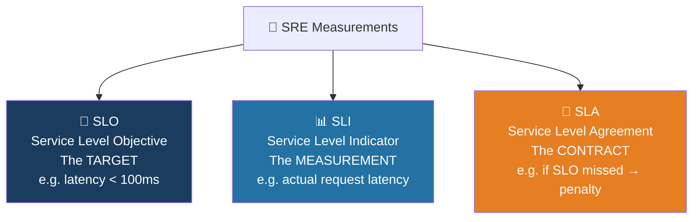

### The Error Budget

An **error budget** is the amount of unreliability you're allowed before action is required. It turns reliability into a concrete, measurable resource:

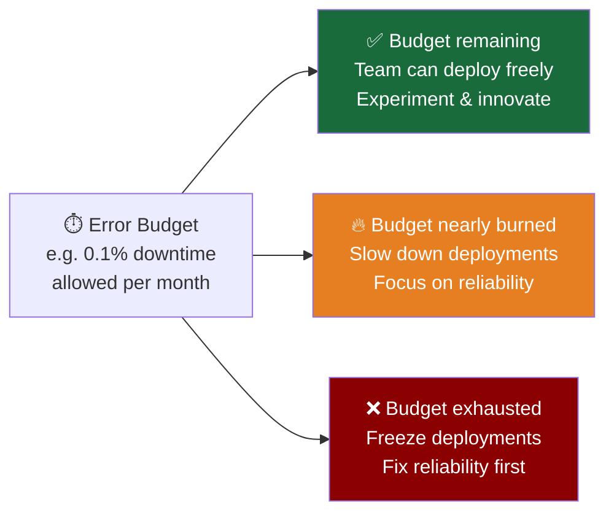

The error budget creates a healthy tension: development teams want to ship fast, while the error budget enforces that they don't ship so fast that reliability suffers. It's an objective, data-driven way to balance innovation and stability.

## Putting It All Together

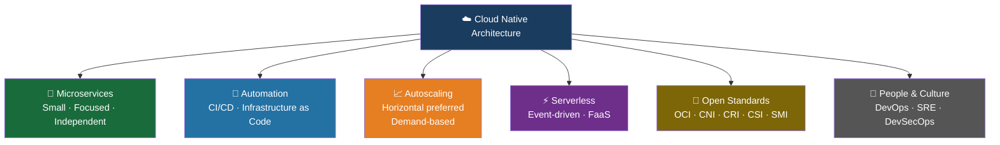

**Key Takeaway**: Cloud native architecture is not just a set of technologies — it's a complete philosophy for building, running, and scaling modern software. Microservices break complexity into manageable pieces. Automation removes human bottlenecks. Open standards prevent lock-in. SRE brings engineering discipline to operations. Together, they form the foundation that makes platforms like Kubernetes not just useful, but essential.
